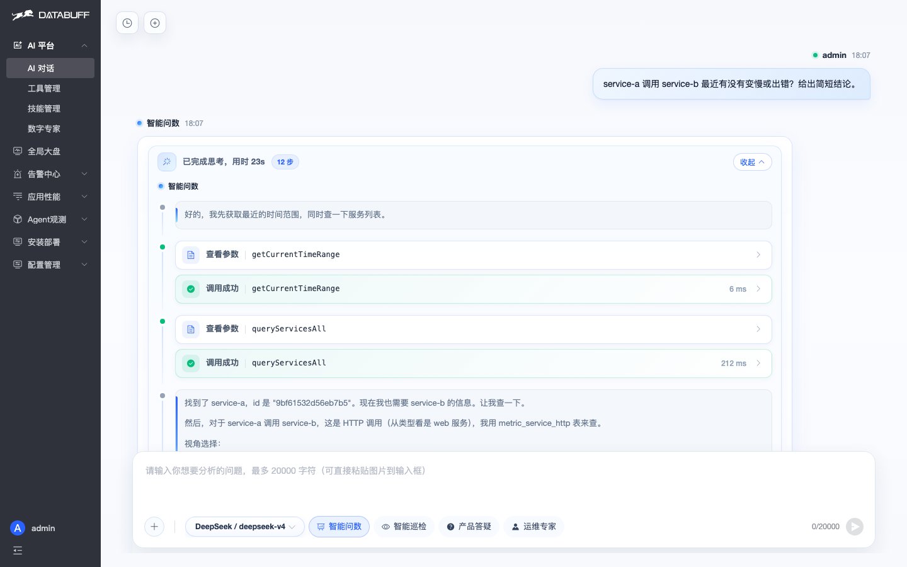
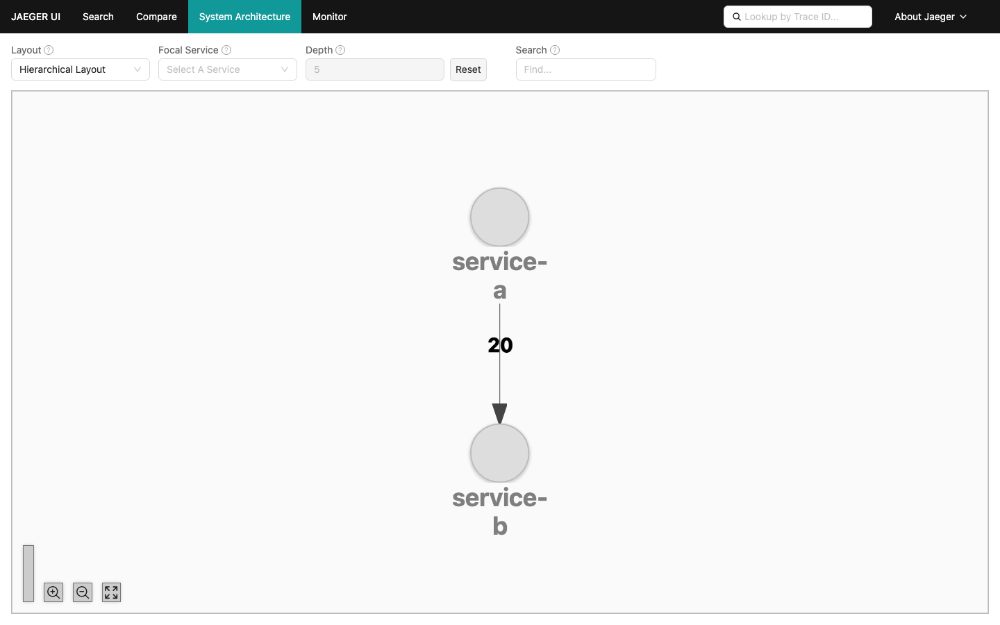
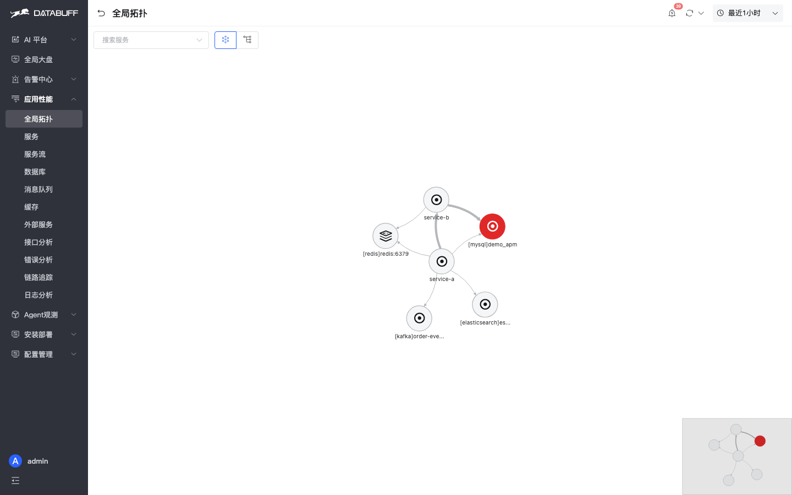
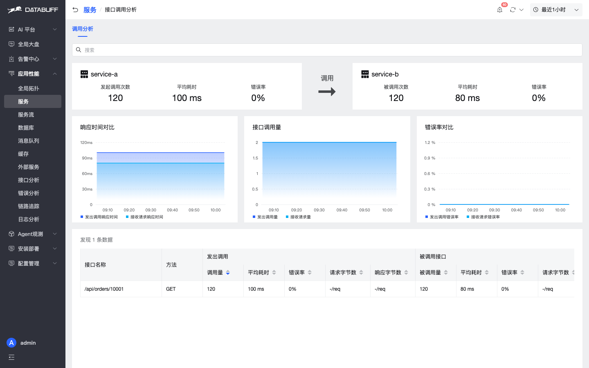
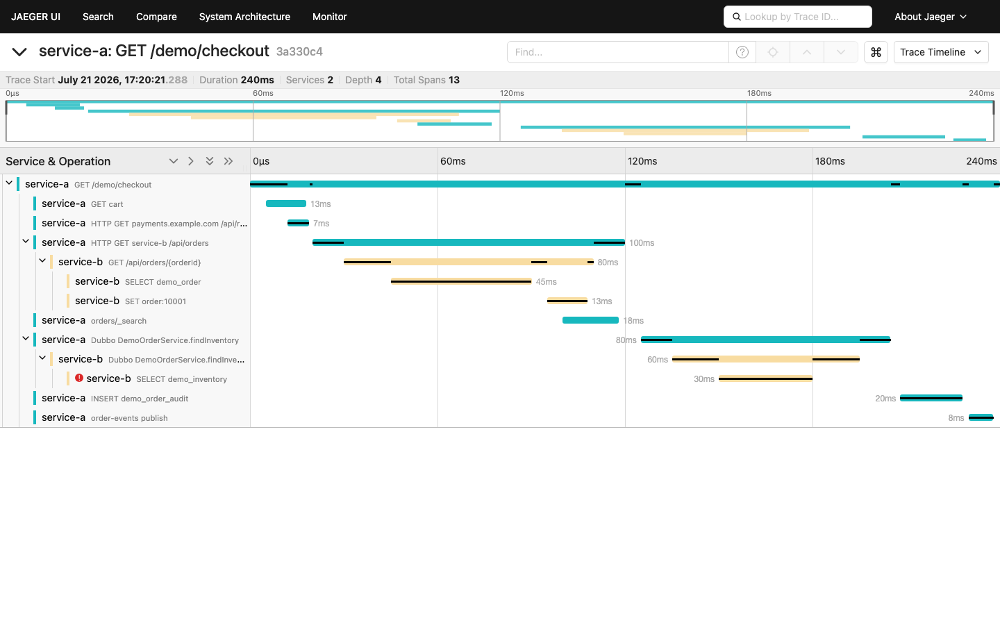
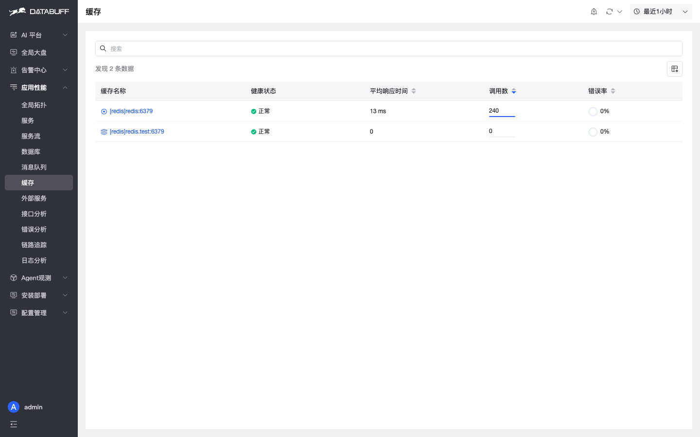

# DataBuff vs Jaeger

> 对比文档 · [English](./vs-jaeger_en.md)

同机实测对比 **DataBuff v0.1.4** 与 **Jaeger v1.76.0**（192.168.50.140）。同一 Demo（service-a / service-b）分别上报 OTLP：DataBuff `:4318`，Jaeger all-in-one UI `:16686`。标记：✅ 本环境可验证 · △ 有入口但深度有限 · ❌ 无等价能力。

博客成稿（HTML + 全量截图）：[DataBuff vs Jaeger：同环境实测对比](https://databuff.ai/blog/databuff-vs-jaeger)

## 一、能力对照全表

**7 大 AI 能力**（v0.1.4：看得见 → 军团协同 → 会巡检 → 会诊断 → 会修复 → 会预测 → 会答疑）

| 能力项 | Jaeger v1.76.0 | DataBuff v0.1.4 |
|--------|---------------|-----------------|
| ① 看得见 · 自然语言问系统 | ❌ | ✅ 中文问服务 / 拓扑 / 异常趋势，AI 直接读遥测作答 |
| ② 军团协同 · 多 Agent 协同 | ❌ | ✅ 多专家并行取证、串行保上下文；任务可编排复用 |
| ③ 会巡检 · 服务巡检 + 报告 | ❌ | ✅ 一句话巡检，输出带证据与处置建议的报告 |
| ④ 会诊断 · 瓶颈 / 根因取证 | ❌ | ✅ 结合 Trace / 指标 / 拓扑拼诊断证据（非黑盒一句「根因」） |
| ⑤ 会修复 · 运维专家处置 | ❌ | ✅ 策略允许 + 人工授权下执行修复；危险命令 denylist |
| ⑥ 会预测 · 容量 / 趋势 | ❌ | ✅ 容量与趋势分析，从事后排障拉到事前预判 |
| ⑦ 会答疑 · 答疑专家 | ❌ | ✅ 检索产品文档与代码，回答部署 / 接入 / 配置问题 |
| 外部拓展 · MCP / Skill / 自定义专家 | ❌ | ✅ 外接 MCP、Skill，并可自定义数字专家扩展排障能力 |

这是差距最大的一组：Jaeger 定位是分布式追踪后端，无等价 AI 平台；DataBuff 把 7 大能力做成可配置首页入口，APM 数据直接作 AI 上下文。

**应用性能（APM）**

| 能力项 | Jaeger v1.76.0 | DataBuff v0.1.4 |
|--------|---------------|-----------------|
| 1. 全局拓扑 | △ Dependencies（服务依赖图；本环境可见 service-a → service-b） | ✅ 全局拓扑 + 健康色标 + 节点下钻（含中间件） |
| 2. 服务列表和黄金指标 | ❌ 仅 Search 页服务下拉，无独立服务列表 / 黄金指标曲线 | ✅ 服务列表 + 曲线；同 demo 可见 service-a / b |
| 3. 服务级拓扑 | △ 依赖 Dependencies，无独立服务级拓扑页 | ✅ 服务级拓扑 |
| 4. 服务级调用分析（上下游指标 + 关联 Trace） | ❌ | ✅ 上下游调用结构与耗时 / 贡献；可直接落到 Trace |
| 5. 实例级黄金指标 | ❌ | ✅ 实例级黄金指标曲线 / 列表 |
| 6. 实例级拓扑 | ❌ | ✅ 独立实例级拓扑 |
| 7. 实例级调用分析（上下游指标 + 关联 Trace） | ❌ | ✅ 按实例看上下游调用与耗时；可直接落到 Trace |
| 8. 接口级拓扑 | ❌ | ✅ 独立接口级拓扑 |
| 9. 接口级调用分析（上下游指标 + 关联 Trace） | ❌ 多靠 Trace 搜索筛选 | ✅ 按接口看调用方 / 被调与耗时；可直接落到 Trace |
| 10. 服务流（服务级 / 接口级 Trace 链路分析） | ❌ Dependencies 只回答「连谁」 | ✅ 按入口展开下游响应贡献度；支持服务级 / 接口级 Trace 链路视角 |
| 11. 中间件 / 外部调用专页（库 / 缓存 / MQ / 外部服务） | ❌ | ✅ 独立专页：数据库 / 缓存 / MQ / 外部服务 |
| 12. 错误分析（统计 + 接口级） | ❌ 多靠 Trace 状态筛选 | ✅ 独立错误分析统计 + 接口级错误下钻 |
| 13. Trace 列表 / 搜索 | ✅ 服务 / 操作 / Tags / 时间；成熟搜索体验 | ✅ 图表 + 列表，多维过滤 |
| 14. Trace 详情 | ✅ 经典 Waterfall + Tags + Span Logs | ✅ 调用次序瀑布图 + Span 属性 |
| 15. Trace Span 关联日志 | △ 仅有 Span Logs（埋点事件），无 OTLP 应用日志关联 | ✅ 顶栏「日志分析」+ Span Logs / 「日志」Tab |
| 16. 日志列表 / 搜索 | ❌ | ✅ 日志分析列表 / 搜索 |
| 17. 日志详情 | ❌ | ✅ |
| 18. 日志关联 Trace | ❌ | ✅ Log → Trace，并可落到具体 Span |

Jaeger 在**纯 Trace 搜索与瀑布图**上成熟、好用；其余 APM 面（服务黄金指标、多级拓扑 / 调用分析、服务流、中间件专页、日志）基本空白。DataBuff 领先在这些纵深能力与 **Span↔日志双向**。

**告警**

| 能力项 | Jaeger v1.76.0 | DataBuff v0.1.4 |
|--------|---------------|-----------------|
| 规则怎么配 | ❌ 无内置告警产品 | ✅ 告警中心内配置，产品化入口 |
| 阈值告警 | ❌ 需外挂 Prometheus / Alertmanager 等 | ✅ 阈值规则可在平台内管理 |
| 智能告警 | ❌ | ✅ 智能告警入口，与 APM 指标联动 |
| 告警事件列表 | ❌ | ✅ 告警列表（等级 / 服务 / 时间等）；本环境非空 |
| 告警落到服务 / 中间件 | ❌ | ✅ 列表直接挂服务 / 中间件，可回 APM 下钻 |

Jaeger 本身不做告警；要阈值 / 通知需另搭监控栈。DataBuff 把规则配置、事件列表与回服务上下文放在同一告警中心。

**适用场景速查**

| 场景 | 更适合 | 说明 |
|------|--------|------|
| 已有 OTLP，想先看 AI / APM 专页 | DataBuff（并跑） | 改上报地址即可 |
| 需要 7 大 AI 能力（问数 / 巡检 / 诊断 / 修复 / 答疑等） | DataBuff | Jaeger 无等价 AI 平台 |
| 要外接 MCP / Skill 或自定义数字专家 | DataBuff | Jaeger 无此层 |
| 要按入口服务看「谁拖慢了响应」 | DataBuff | 服务流 + 响应贡献度；Jaeger 无等价页 |
| 要从服务 / 实例 / 接口调用分析落到 Trace | DataBuff | Jaeger 无此路径 |
| 要查慢 SQL / 缓存 / MQ 专页 | DataBuff | Jaeger 不提供中间件专页 |
| 要日志 + Trace 关联分析 | DataBuff | Jaeger 无日志产品面 |
| 要内置告警 / 智能告警 | DataBuff | Jaeger 需外挂 |
| 只要轻量 Trace 存储 + 瀑布图 | Jaeger / 两者皆可 | 不必为换品牌迁移 |
| 已有 ES / Cassandra 且只做 Trace | Jaeger | 可复用现有存储；DataBuff 亦可 OTLP 并跑 |

**客观边界：** 已深度绑定 Jaeger 搜索工作流、或只需要 Trace 存储与瀑布图时，继续用 Jaeger 完全合理。DataBuff 适合「同一 OTLP 数据 + AI + APM 纵深 + 告警」的并跑或渐进切换。

## 二、截图证据（解释上表）

下列截图均来自同环境实测。图注对应能力项；重点展示 DataBuff 多出来的 7 大 AI 能力 / 调用分析 / 专页 / 告警。Jaeger 优势项是纯 Trace 搜索与瀑布图。

**7 大 AI 能力**（Jaeger 无等价界面，以 DataBuff 举证）

**服务与拓扑**

**服务级 / 接口级调用分析 + 服务流**（对应上表 4 / 9 / 10）

Jaeger Dependencies 只回答「连谁」，没有服务级 / 实例级 / 接口级「调用分析」，也没有服务流上的响应贡献度。DataBuff 从「看见连谁」到「谁拖慢、再点进 Trace」。

**Trace**（Jaeger 成熟面）

**日志**（对应上表 16–18；Jaeger 无等价）

**DataBuff 专页纵深**（对应上表 11 / 12；Jaeger 无等价专页）

这些专页是「Dependencies 能看见连谁」之后的纵深——相对 Jaeger 最值得并跑验证的应用性能差异。

**告警**（Jaeger 无内置告警）

---

觉得有用的话，欢迎给我们一个 Star，也欢迎提 Issue / PR：  
https://github.com/databufflabs/databuff
