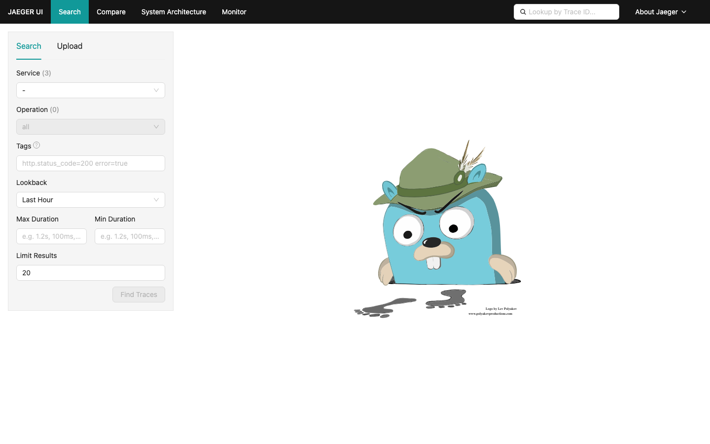
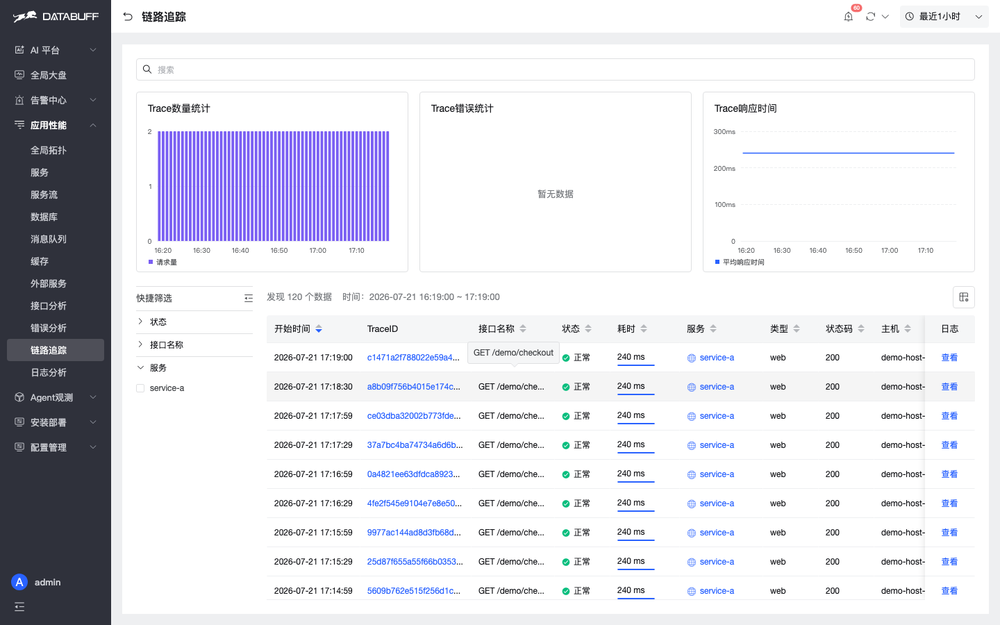
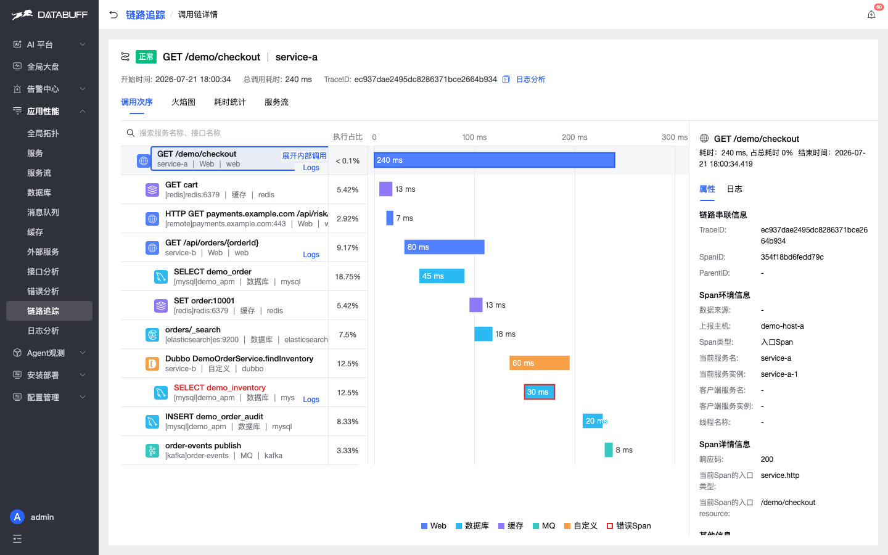
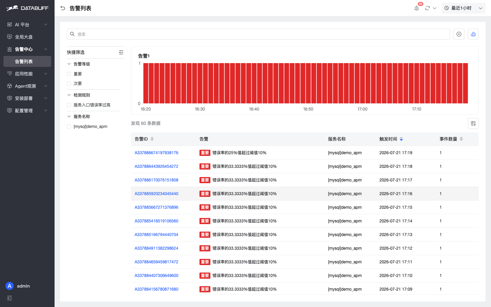

# DataBuff vs Jaeger

> 对比文档 · 客观中立 · [English](./vs-jaeger_en.md)

本文基于同环境实测对比 DataBuff v0.1.4 与 Jaeger v1.76.0，部署同一 Demo 应用（OTLP 协议）发送链路数据，逐页截图对比两系统在 Trace 查询、拓扑、AI 等维度的能力差异。

## 能力边界总览

| 维度 | Jaeger | DataBuff |
|------|--------|----------|
| 定位 | 分布式追踪后端（Trace 存储 + UI） | AI Native OTel APM（Trace + Metrics + Log + AI） |
| 协议 | OTLP（gRPC/HTTP）、Jaeger Thrift、Jaeger Protobuf | OTLP（gRPC/HTTP）、SkyWalking gRPC |
| 部署形态 | All-in-one / Collector + Storage（ES/Cassandra） | 三组件：Doris（存储）+ Ingest（摄取）+ Web（UI/AI） |
| 内置存储 | Badger（all-in-one 模式）；ES/Cassandra（生产） | Doris（列式存储，内置） |
| AI 排障能力 | ❌ 无 | ✅ 内置 AI 排障引擎 |
| Trace 查询 | ✅ 基础搜索（服务/操作/Tags/时间） | ✅ 高级查询 + 聚合视图 |
| 拓扑视图 | ❌ 需 Grafana 或第三方 | ✅ 内置全局拓扑 |
| 告警管理 | ❌ 无内置告警 | ✅ 内置告警（阈值/智能） |
| 日志分析 | ❌ 无 | ✅ 支持 OTLP 日志 + Trace 关联 |
| 自运维 | ❌ 无 | ✅ 内置排障模式、自动恢复 |

## 实测环境

| 项目 | 说明 |
|------|------|
| 测试机器 | MacBook Pro（本地 Docker） |
| DataBuff 版本 | v0.1.4（deploy/local） |
| Jaeger 版本 | v1.76.0（jaegertracing/all-in-one） |
| Demo 应用 | DataBuff demo-seeder（Java OTLP SDK） |
| 发送协议 | OTLP HTTP（v1/traces） |
| 数据量 | 约 1 trace/30s，双服务（service-a / service-b） |

## 逐项截图对比

### 1. Trace 搜索与列表

**Jaeger Trace 搜索页**：按服务、操作、Tags、时间范围搜索，列表展示 TraceID、耗时、Span 数，无聚合视图。

**DataBuff 链路追踪**：同样 OTLP 数据，提供多维过滤、耗时分布、服务级聚合，列表更丰富。

对比小结：Jaeger 仅提供基础 Trace 搜索，需人工逐条翻找慢调用；DataBuff 支持聚合排序、一键定位异常。

### 2. Trace 详情（Waterfall）

**Jaeger Trace 详情**：经典 Waterfall 视图，展示 Span 时间轴、Tags、Process、Logs。

**DataBuff Trace 详情**：调用次序瀑布图展示 service-a → service-b / Redis / MySQL / Kafka 等 Span，右侧可查看属性与关联日志跳转。

对比小结：两者均提供标准 Waterfall 视图；DataBuff 额外提供服务拓扑嵌入和日志关联跳转。

### 3. 系统拓扑

**Jaeger 依赖关系图**：展示服务间的调用关系（基于 Span 的 childOf/FollowsFrom 统计），粒度较粗。

**DataBuff 全局拓扑**：实时服务拓扑，支持节点下钻（服务→接口→Trace），AI 增强展示。

对比小结：Jaeger 仅提供静态依赖图，DataBuff 提供可交互的实时拓扑，支持一键下钻到具体 Trace。

### 4. 服务列表

**DataBuff 服务视图**：展示所有接入服务、黄金指标（吞吐/错误/延时）、列表支持排序与搜索。

Jaeger 无独立服务列表页，仅在搜索页下拉框中选择服务。

### 5. AI 能力

**DataBuff AI 对话**：内置 AI 排障引擎，支持自然语言查询 Trace/指标/日志，自动关联上下文。

Jaeger 不具备 AI 能力。

### 6. 告警管理

**DataBuff 告警中心**：内置告警管理，支持阈值告警、智能告警、告警列表与通知。

Jaeger 无内置告警功能。

## 适用场景

| 场景 | Jaeger | DataBuff |
|------|--------|----------|
| 纯 Trace 存储与查看 | ✅ 适合 | ✅ 适合 |
| 已有 ES/Cassandra 基础设施 | ✅ 可利用 | ✅ 可用 OTLP 双跑 |
| 需要 AI 辅助排障 | ❌ | ✅ 核心优势 |
| 需要全局拓扑下钻 | ❌ 需 Grafana | ✅ 内置 |
| 需要告警管理 | ❌ 需 Prometheus/AlertManager | ✅ 内置 |
| 日志+Trace 关联分析 | ❌ | ✅ |
| 快速部署开箱即用 | ✅ All-in-one | ✅ Docker Compose |
| 减少组件维护 | ❌ 需自建存储 | ✅ 存储内置 |

## 不适用场景

- **纯 Metrics 监控**：DataBuff 虽支持 OTLP Metrics 但非专长；Jaeger 不支持 Metrics
- **纯日志分析**：DataBuff 支持 OTLP 日志；Jaeger 不支持日志
- **需要自建复杂存储管线**：Jaeger 依赖 Elasticsearch/Cassandra 等外部存储，DataBuff 内置 Doris

## 延伸阅读

- [DataBuff 快速入门](/docs/zh/guide/otel-otlp-ingestion)
- [DataBuff vs SkyWalking](/docs/zh/comparison/vs-skywalking)
- [迁移指南：从 Jaeger 到 DataBuff](/docs/zh/migration/from-jaeger)（即将发布）

---

觉得有用的话，欢迎给我们一个 Star，也欢迎提 Issue / PR：  
https://github.com/databufflabs/databuff
