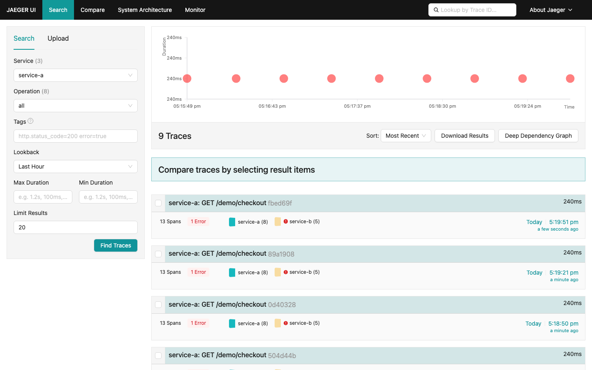

# DataBuff vs Jaeger

> Objective comparison · [中文](./vs-jaeger.md)

This comparison is based on a real environment running DataBuff v0.1.4 and Jaeger v1.76.0 with the same demo application sending OTLP traces.

## Capability Matrix

| Dimension | Jaeger | DataBuff |
|-----------|--------|----------|
| Positioning | Distributed tracing backend (Trace storage + UI) | AI Native OTel APM (Trace + Metrics + Log + AI) |
| Protocols | OTLP (gRPC/HTTP), Jaeger Thrift, Jaeger Protobuf | OTLP (gRPC/HTTP), SkyWalking gRPC |
| Deployment | All-in-one / Collector + Storage (ES/Cassandra) | 3 components: Doris (storage) + Ingest + Web (UI/AI) |
| Built-in Storage | Badger (all-in-one); ES/Cassandra (production) | Doris (columnar, built-in) |
| AI Troubleshooting | ❌ None | ✅ Built-in AI engine |
| Trace Query | ✅ Basic (service/operation/tags/time) | ✅ Advanced + aggregated views |
| Topology | ❌ Requires Grafana | ✅ Built-in global topology |
| Alerting | ❌ None | ✅ Built-in (threshold/smart) |
| Log Analytics | ❌ None | ✅ OTLP logs + Trace correlation |
| Self-ops | ❌ None | ✅ Built-in troubleshooting mode |

## Screenshot Comparison

### 1. Trace Search & Listing

**Jaeger Trace Search**: Filter by service, operation, tags, time range. Shows TraceID, duration, span count.

**DataBuff Trace Listing**: Multi-dimensional filtering, duration distribution, service-level aggregation.

### 2. Trace Detail (Waterfall)

**Jaeger Trace Detail**: Classic waterfall view with span timeline, tags, process, logs.

**DataBuff Trace Detail**: Call-order waterfall for the same OTLP demo (`GET /demo/checkout` on service-a, downstream service-b / Redis / MySQL / Kafka), with span properties and log jump-off.

### 3. Topology

**Jaeger Dependencies**: Static service dependency graph based on span relationships.

**DataBuff Global Topology**: Real-time interactive topology with service-to-trace drill-down.

### 4. AI Chat

**DataBuff AI Platform**: Built-in AI for natural language trace/metric/log queries.

### 5. Alerting

**DataBuff Alert Center**: Built-in alert management with threshold and smart alerts.

## Use Cases

| Scenario | Jaeger | DataBuff |
|----------|--------|----------|
| Trace storage & viewing | ✅ Good | ✅ Good |
| Existing ES/Cassandra infra | ✅ Reuse | ✅ Dual-run OTLP |
| AI-assisted troubleshooting | ❌ | ✅ Core strength |
| Topology drill-down | ❌ Needs Grafana | ✅ Built-in |
| Alerting | ❌ Needs Prometheus/AM | ✅ Built-in |
| Log + Trace correlation | ❌ | ✅ |
| Quick deployment | ✅ All-in-one | ✅ Docker Compose |
| Reduced component maintenance | ❌ External storage | ✅ Built-in storage |

## See Also

- [DataBuff Quick Start](/docs/en/guide/otel-otlp-ingestion)
- [DataBuff vs SkyWalking](/docs/en/comparison/vs-skywalking)
- [Migration: From Jaeger to DataBuff](/docs/en/migration/from-jaeger) (Coming Soon)

---

If this comparison helped, please give us a Star — Issues and PRs welcome:  
https://github.com/databufflabs/databuff
