# DataBuff vs OpenObserve

> Comparison · [中文](./vs-openobserve.md)

Same-host lab on `192.168.50.140`: **DataBuff v0.1.4** vs **OpenObserve v0.91.0-rc1**, same Demo (`service-a` / `service-b`). DataBuff uses OTLP `:4318`; OpenObserve OTLP HTTP is `:5080/api/default`. Marks: ✅ verified in this lab · △ present but limited · ❌ no equivalent.

Full HTML article with screenshots: [DataBuff vs OpenObserve (lab compare)](https://databuff.ai/blog/databuff-vs-openobserve)

Positioning: DataBuff = AI-native APM depth; OpenObserve = unified observability platform (Logs / Metrics / Traces / RUM), strong on log search and object-storage cost.

## 1. Capability matrix

**Seven AI capabilities** (v0.1.4: See → Squad → Inspect → Diagnose → Repair → Predict → Answer)

| Capability | OpenObserve v0.91.0-rc1 | DataBuff v0.1.4 |
|------------|------------------------|-----------------|
| ① See · natural-language questions | ❌ | ✅ Ask about services / topology / trends; AI reads telemetry |
| ② Squad · multi-agent collaboration | ❌ | ✅ Parallel evidence gathering; serial context preservation; reusable task orchestration |
| ③ Inspect · service inspection + report | ❌ | ✅ One-shot inspection with evidence and recommended actions |
| ④ Diagnose · bottleneck / RCA evidence | ❌ | ✅ Trace / metrics / topology evidence (not a black-box “root cause”) |
| ⑤ Repair · Ops Expert actions | ❌ | ✅ Repair under policy + human approval; dangerous-command denylist |
| ⑥ Predict · capacity / trends | ❌ | ✅ Capacity and trend analysis — from after-the-fact to ahead-of-time |
| ⑦ Answer · product Q&A | ❌ | ✅ Answers deploy / ingest / config from docs and code |
| Extend · MCP / Skill / custom experts | ❌ | ✅ External MCP / Skill and custom digital experts |

Largest gap: OpenObserve has no equivalent AI platform (Traces has an LLM Insights entry, not validated here as APM triage); DataBuff exposes the seven capabilities as configurable home entries with APM as AI context.

**APM**

| Capability | OpenObserve v0.91.0-rc1 | DataBuff v0.1.4 |
|------------|------------------------|-----------------|
| 1. Global topology | ❌ No service dependency topology | ✅ Global topology + health colors + node drill-down |
| 2. Service list & golden metrics | ✅ Service Catalog (Requests / Error Rate / P99, etc.) | ✅ Service list + charts; same demo shows service-a / b |
| 3. Service-level topology | ❌ | ✅ Dedicated service topology |
| 4. Service call analysis (up/downstream + Trace) | ❌ | ✅ Upstream/downstream structure, latency/contribution; drill to Trace |
| 5. Instance golden metrics | ❌ | ✅ Instance golden-metric charts / list |
| 6. Instance topology | ❌ | ✅ Dedicated instance topology |
| 7. Instance call analysis (up/downstream + Trace) | ❌ | ✅ Per-instance up/downstream + Trace |
| 8. Endpoint topology | ❌ | ✅ Dedicated endpoint topology |
| 9. Endpoint call analysis (up/downstream + Trace) | ❌ | ✅ Per-endpoint caller/callee + Trace |
| 10. Service flow (service / endpoint Trace contribution) | ❌ | ✅ Response contribution from entry; service / endpoint Trace view |
| 11. Middleware / external pages (DB / cache / MQ / external) | ❌ db/http visible on Span fields; no dedicated pages | ✅ Dedicated pages: DB / cache / MQ / external |
| 12. Error analysis (stats + endpoint) | △ Can filter ERROR spans / logs | ✅ Error stats + endpoint drill-down |
| 13. Trace list / search | ✅ Spans/Traces + flexible query; this lab shows service-a · GET /demo/checkout | ✅ Charts + list, multi-dimension filters |
| 14. Trace detail | ✅ Waterfall / Flame Graph / Trace Graph | ✅ Call-order waterfall + Span attributes |
| 15. Trace Span → logs | ✅ Trace / Span can link to logs | ✅ Top “Log analysis” + Span Logs / Logs tab |
| 16. Log list / search | ✅ Strength: SQL / full-text + histogram; hundreds of events in this lab | ✅ |
| 17. Log detail | ✅ | ✅ |
| 18. Log → Trace | ✅ Log → Trace (down to Span) | ✅ Log → Trace, down to Span |
| 19. Flexible Metrics query (SQL / PromQL) | ✅ Metrics page: SQL / PromQL / Builder | △ Internal SQL; no public PromQL entry |
| 20. Custom dashboards | ✅ Dashboards can be created (list may be empty in this lab; capability present) | ❌ Not yet |
| 21. Unified storage cost (object store + compression) | ✅ Home shows Ingested / Compressed (~96MB → 10.5MB in this lab) | △ Doris columnar; not an object-storage cost story |
| 22. RUM | ✅ Built-in RUM (Real User Monitoring) | ❌ Not yet |
| 23. Pipelines | ✅ Realtime / Scheduled: transform / enrich / filter / route after ingest (VRL); logs→metrics, etc. | ❌ Not yet |
| 24. Reports | ✅ Scheduled / Cached reports; timed generate & distribute | ❌ Not yet |

Shared base: service list & golden metrics, Trace list/waterfall, logs, and Span↔log links. DataBuff leads on **topology / service·instance·endpoint call analysis / service flow / middleware pages**. OpenObserve leads on **log search & cost, SQL/PromQL, custom dashboards, Pipelines, Reports, unified L/M/T + RUM**.

**Alerting**

| Capability | OpenObserve v0.91.0-rc1 | DataBuff v0.1.4 |
|------------|------------------------|-----------------|
| How rules are configured | ✅ Alerts UI (needs Destination / Template first) | ✅ Alert center in product |
| Threshold alerts | ✅ Scheduled / Realtime | ✅ Managed in platform |
| Smart alerts | ❌ No equivalent smart-alert product | ✅ Smart alerts linked with APM metrics |
| Alert event list | ✅ Alerts UI for triggered alerts / rules | ✅ Alert list (severity / service / time) |
| Alerts linked to service / middleware | △ Stream-oriented alerts; APM context must be stitched manually | ✅ List links service / middleware back into APM |

Both can configure alerts in UI; difference is **smart alerts** and **alert → APM service context**. OpenObserve alerts lean Logs/Metrics streams; DataBuff leans APM triage loop.

**When to pick which**

| Scenario | Better fit | Note |
|----------|------------|------|
| Already on OTLP; want AI / APM depth first | DataBuff | Point exporters at DataBuff; no need to migrate off OpenObserve first |
| Need the seven AI capabilities (ask / inspect / diagnose / repair / predict / answer) | DataBuff | OpenObserve has no equivalent AI platform |
| Need MCP / Skill or custom digital experts | DataBuff | AI platform is extensible; OO has no such layer |
| Need global topology + health colors at a glance | DataBuff | OO has no service dependency topology |
| Need “who slowed the response” from entry service | DataBuff | Service flow + contribution; OO has no equivalent page |
| Need service / instance / endpoint call analysis → Trace | DataBuff | Three-level call analysis all link to Trace; OO has no path |
| Need instance golden metrics / instance topology | DataBuff | OO has no equivalent instance pages |
| Need slow SQL / cache / MQ / external service pages | DataBuff | OO mostly Span fields; no dedicated pages |
| Need dedicated error analysis (stats + endpoint drill-down) | DataBuff | OO requires manual ERROR filtering |
| Need smart alerts tied to service / middleware | DataBuff | OO alerts are stream-oriented; no smart-alert APM loop |
| Huge log volume; need object-storage cost control | OpenObserve | Compression / storage story is a strength |
| Need SQL / PromQL Metrics + custom dashboards | OpenObserve | DataBuff has no custom dashboards yet |
| Need post-ingest transform / enrich / filter / route (pipelines) | OpenObserve | Pipelines (Realtime / Scheduled + VRL) |
| Need scheduled / cached reports | OpenObserve | Reports (Scheduled / Cached) |
| Need unified Logs + Metrics + Traces + RUM data plane | OpenObserve | DataBuff focuses on APM depth |
| Only need the same Demo Trace waterfall | Either | No need to migrate for branding |

**Boundary:** Staying on OpenObserve is reasonable when deeply tied to its log pipelines / dashboards / Pipelines / Reports / cost story. DataBuff fits OTLP + seven AI + topology / call analysis / service flow / dedicated pages / smart alerts. Dashboards, Pipelines, Reports, and large-scale log cost are not peer capabilities yet.

## 2. Screenshot evidence

Screenshots from the same lab (`192.168.50.140`). Captions map to matrix rows; focus on DataBuff AI / topology / dedicated pages / alerts, plus OpenObserve logs / Trace / Metrics / dashboard entry points.

**Seven AI capabilities** (no OpenObserve equivalent UI; DataBuff evidence)

**Overview & data plane**

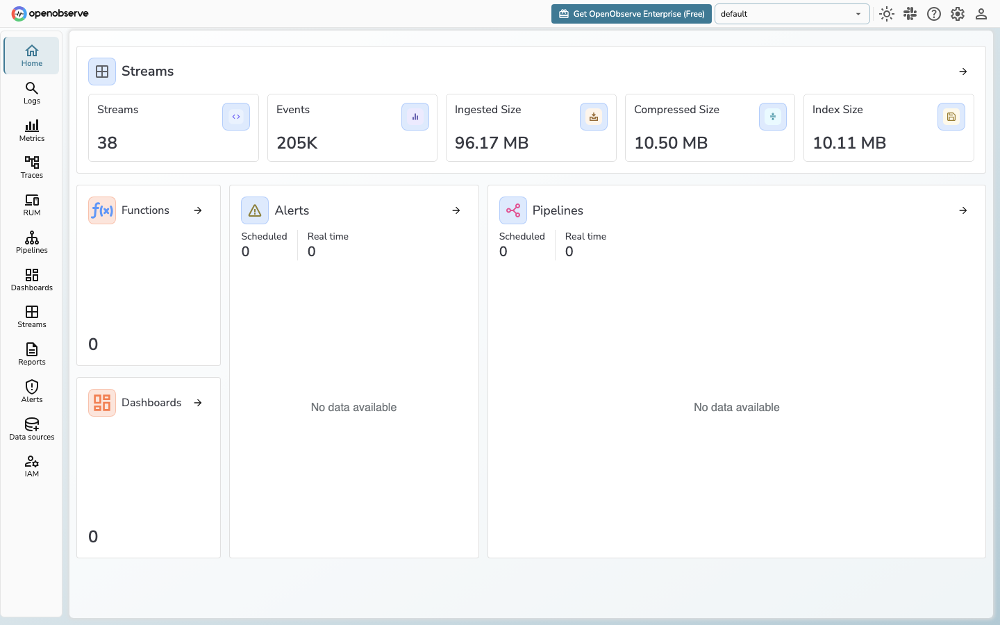

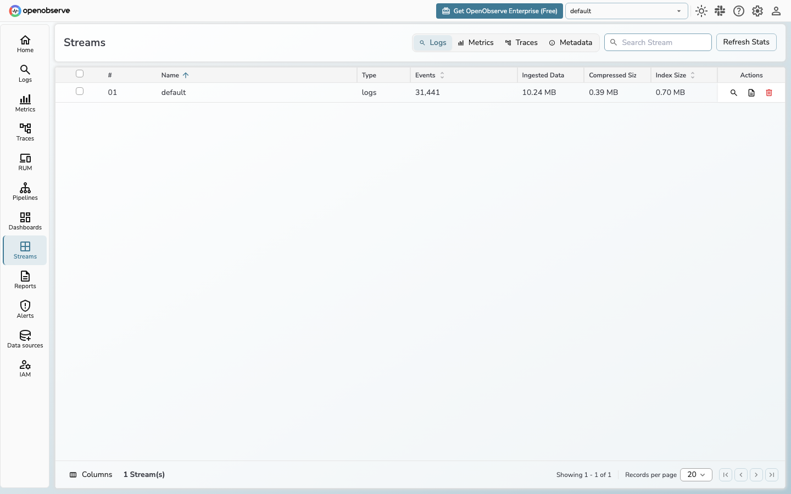

**Services & topology**

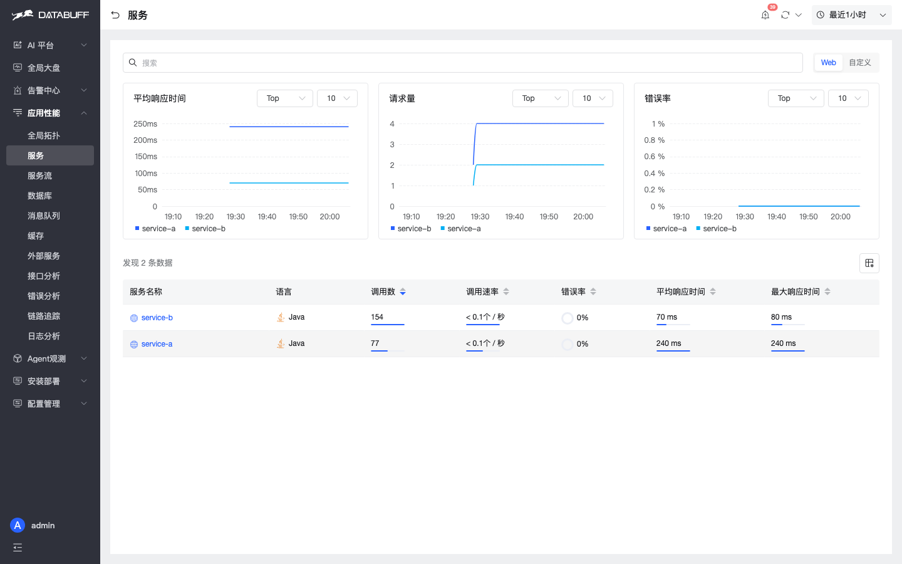

**Service / endpoint call analysis + service flow** (matrix rows 4 / 9 / 10)

OpenObserve can list Trace / Span, but has no service / instance / endpoint call analysis, and no service-flow contribution view. DataBuff goes from “who connects” to “who slows, then into Trace”.

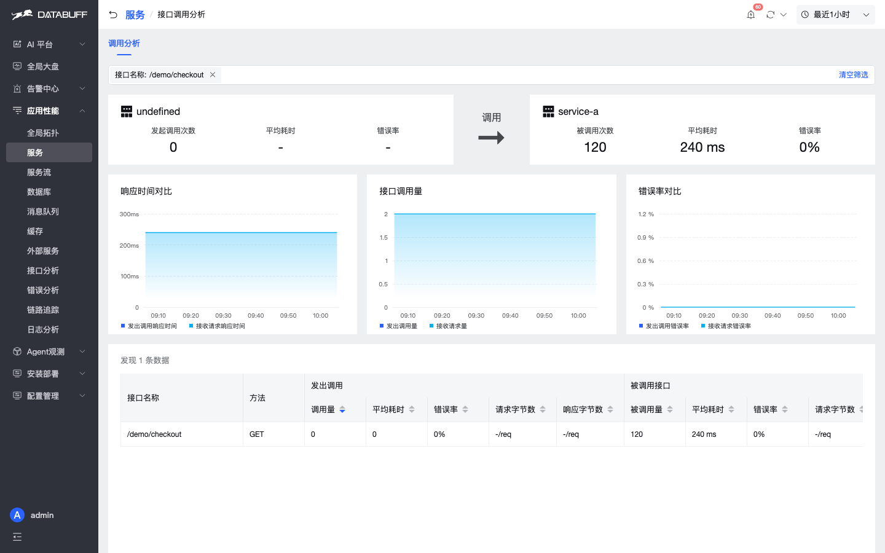

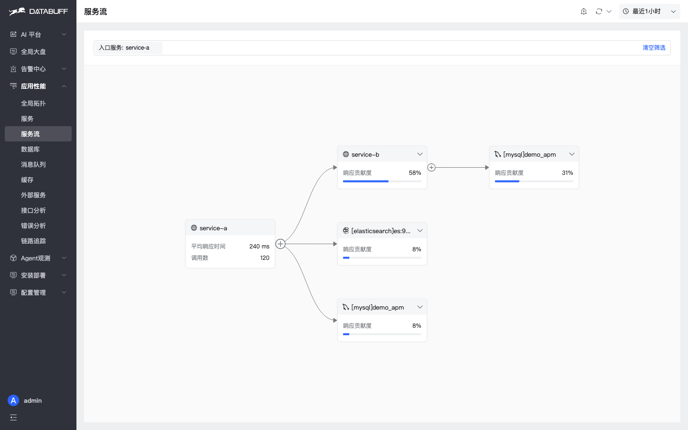

**Trace**

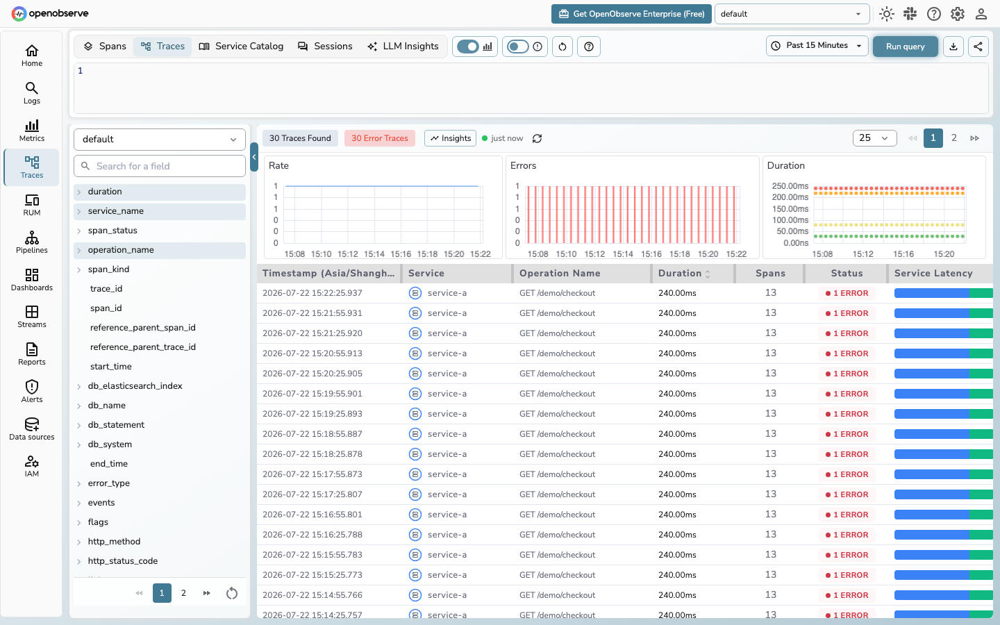

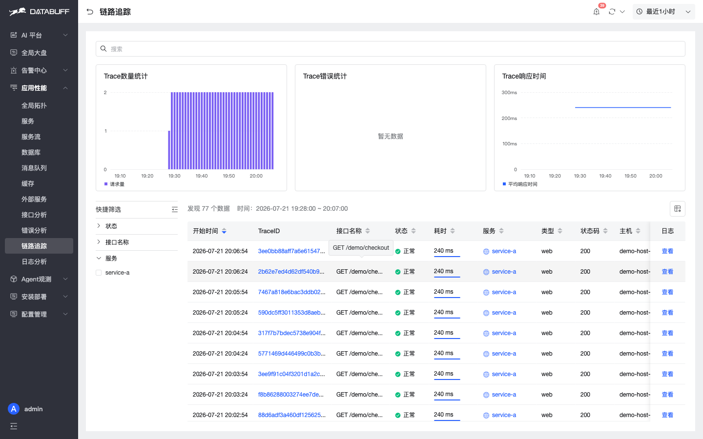

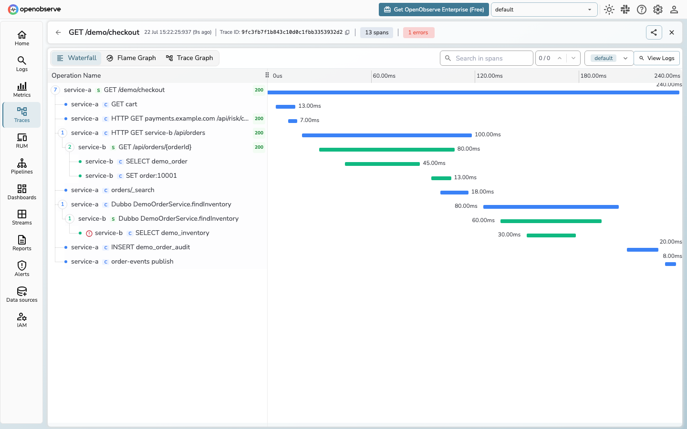

**Log / Metric**

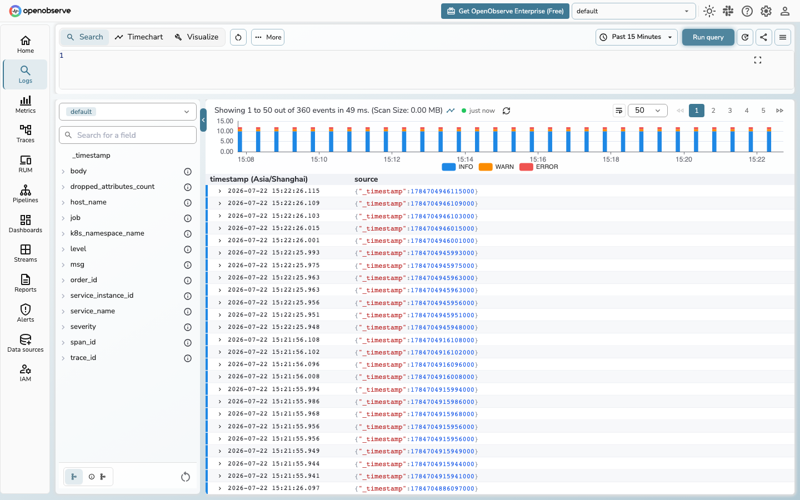

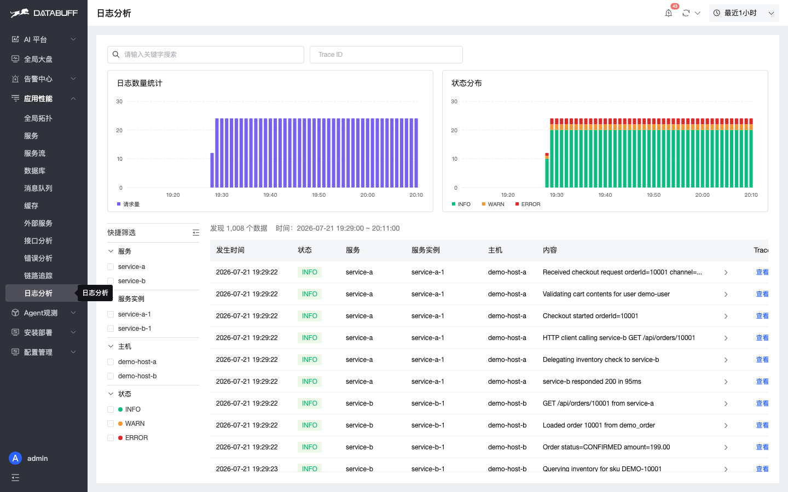

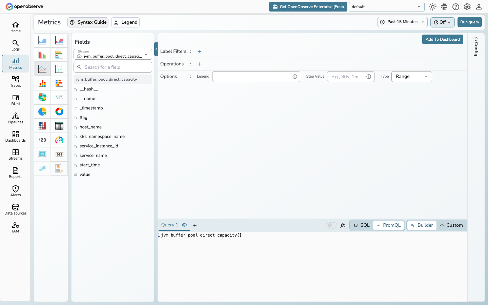

**Dashboards / Pipelines / Reports** (matrix rows 20 / 23 / 24; OpenObserve strengths)

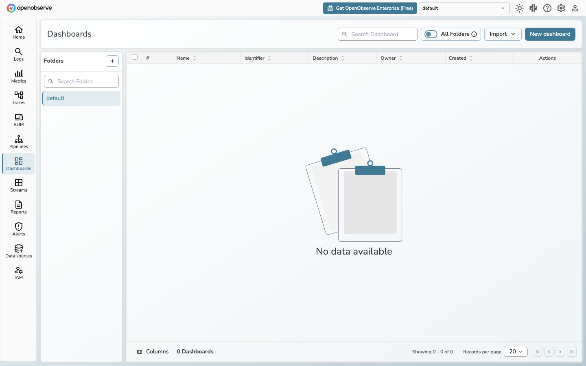

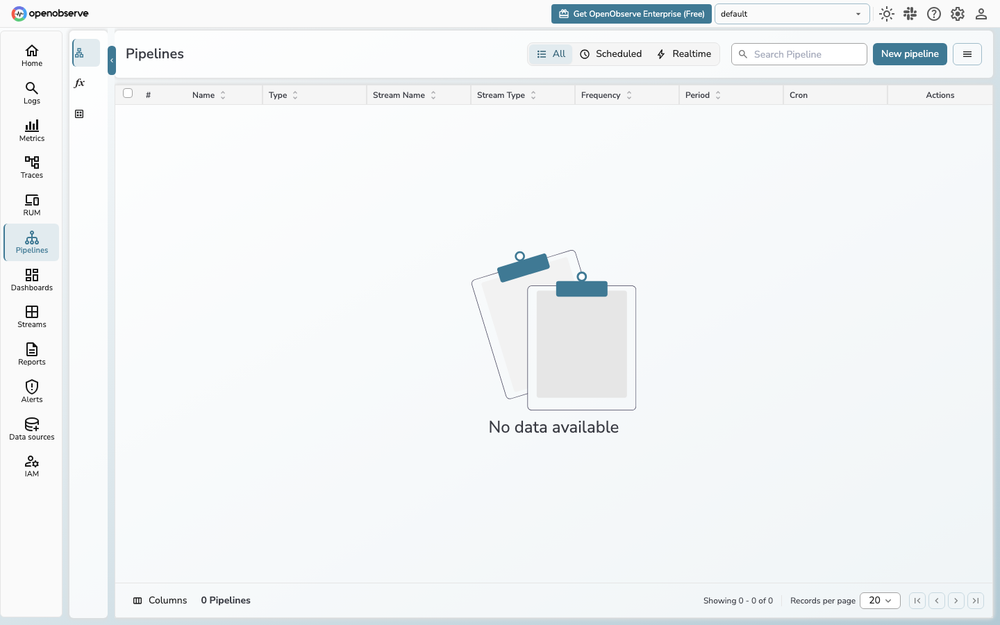

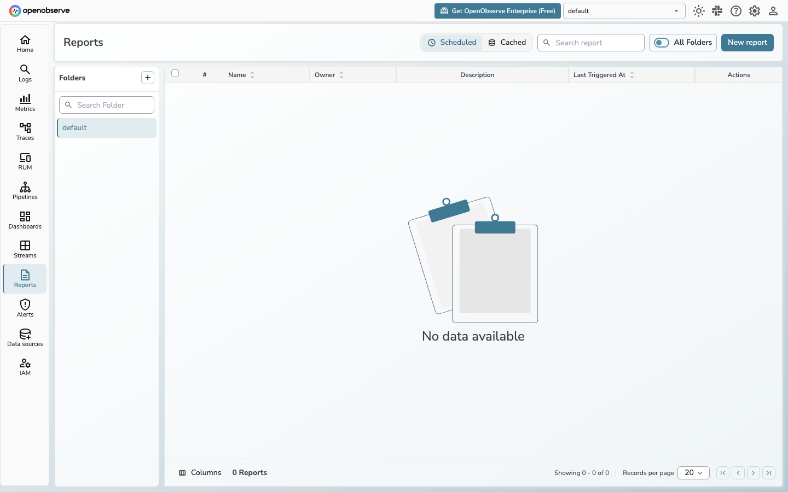

**DataBuff dedicated pages** (matrix rows 11 / 12; no OO equivalents)

These pages are depth beyond “middleware Spans in Trace” — the APM differences most worth validating against OpenObserve.

**Alerting**

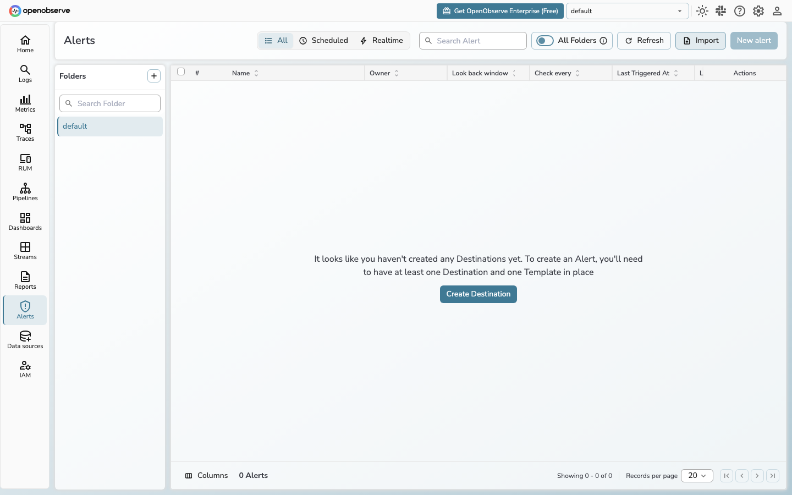

---

If this was useful, a Star (and Issues / PRs) are welcome:  
https://github.com/databufflabs/databuff

Online Demo: https://demo.databuff.ai
