# DataBuff vs Pinpoint

Side-by-side lab comparison of **DataBuff v0.1.4** and **Pinpoint 3.1.0** on `192.168.50.140`. Both stacks run on the same host: DataBuff ingests OTLP on `:4318` (`service-a` / `service-b`); Pinpoint uses the official quickstart Java Agent (`application=pinpoint-quickapp`, Web `:18080` / Demo `:18085`). Legend: ✅ verified in this lab · △ entry exists but limited depth here · ❌ no equivalent capability.

## Capability matrix

**7 AI capabilities** (v0.1.4)

| Capability | Pinpoint 3.1.0 | DataBuff v0.1.4 |
|------------|----------------|-----------------|
| ① Ask the system in natural language | ❌ | ✅ Chinese Q&A over services / topology / anomalies |
| ② Multi-agent collaboration | ❌ | ✅ Parallel experts with shared context |
| ③ Inspection reports | ❌ | ✅ One-shot inspection with evidence |
| ④ Diagnosis / root-cause evidence | ❌ | ✅ Trace + metrics + topology evidence |
| ⑤ Remediation (ops expert) | ❌ | ✅ Policy-gated, human-authorized fixes |
| ⑥ Prediction / capacity | ❌ | ✅ Trend & capacity analysis |
| ⑦ Product Q&A expert | ❌ | ✅ Answers deploy / ingest / config questions |
| Extensibility · MCP / Skill / custom experts | ❌ | ✅ External MCP / Skill + custom experts |

Largest gap: Pinpoint has no AI platform; DataBuff uses APM telemetry as AI context.

**APM**

| Capability | Pinpoint 3.1.0 | DataBuff v0.1.4 |
|------------|----------------|-----------------|
| 1. Global topology | ✅ Server Map (USER→App, throughput/latency) | ✅ Topology + health colors + drill-down |
| 2. Service list & golden signals | ✅ Apdex / Success·Failed / Response Summary | ✅ Service list + charts |
| 3. Service-level topology | ✅ Server Map node view | ✅ Service topology |
| 4. Service call analysis → Trace | ❌ No upstream/downstream contribution page | ✅ Call structure + latency contribution → Trace |
| 5. Instance golden signals | △ VIEW SERVERS shows agents; Inspector API not ready in this lab | ✅ Instance metrics |
| 6. Instance topology | ❌ | ✅ |
| 7. Instance call analysis → Trace | ❌ | ✅ |
| 8. API-level topology | ❌ | ✅ |
| 9. API call analysis → Trace | △ URL Statistic entry; API 404 in this lab | ✅ |
| 10. Service flow / response contribution | ❌ Server Map answers “who connects / how many” | ✅ Contribution by downstream → Trace |
| 11. Middleware specialty pages | △ Nodes may appear on map; no deep pages | ✅ DB / cache / MQ / external |
| 12. Error analysis | △ Error Analysis entry; API 404 in this lab | ✅ |
| 13. Trace list / search | ✅ Scatter brush → Transaction List | ✅ Charts + filters |
| 14. Trace detail | ✅ Call Tree / Server Map / Flame Graph (method-level) | ✅ Waterfall + span attrs |
| 15. Span ↔ logs | ❌ | ✅ |
| 16–18. Logs & log↔trace | ❌ No log platform | ✅ including span-level link |
| 19. Profiling | △ Java call stacks / active threads | ❌ not yet |
| 20. Custom dashboards | ❌ | ❌ not yet |
| Protocol / languages | Proprietary Java Agent | OTLP multi-language + SkyWalking gRPC |

Pinpoint leads on **Java method-level Call Tree** and the classic **Server Map + Scatter + Apdex** workspace. DataBuff leads on **multi-language OTel**, **call analysis / service flow**, **middleware pages**, **log↔trace**, and **AI**.

**Alerting**

| Capability | Pinpoint 3.1.0 | DataBuff v0.1.4 |
|------------|----------------|-----------------|
| Rule authoring | △ Administration → Alarm / Webhook | ✅ In-product alert center |
| Threshold alerts | △ Admin-side | ✅ |
| Smart alerts | ❌ | ✅ |
| Alert event list | △ | ✅ non-empty in this lab |
| Jump back to service / middleware | △ mostly via notifications | ✅ |

**When to choose which**

| Scenario | Better fit | Note |
|----------|------------|------|
| Pure Java, need method-level Call Tree / Flame Graph | Pinpoint | Verified in this lab |
| Server Map + Scatter + Apdex in one page | Pinpoint | Brush into transactions |
| Deep Pinpoint plugin / manual API lock-in | Pinpoint | Agent swap cost is high |
| Need the 7 AI capabilities | DataBuff | No Pinpoint equivalent |
| Multi-language / existing OTel or SW agents | DataBuff | OTLP + SW gRPC |
| Service flow / call analysis → Trace | DataBuff | No Pinpoint equivalent page |
| Slow SQL / cache / MQ pages + logs | DataBuff | No Pinpoint log platform |
| Java traces only, no AI | Either | No need to migrate for brand |

**Boundary:** Pinpoint remains solid for deep Java call stacks and classic Server Map UX. Moving to DataBuff means swapping the proprietary agent for OTel — higher cost than “only change SkyWalking collector host”.

## Screenshot evidence

All shots from **192.168.50.140**.

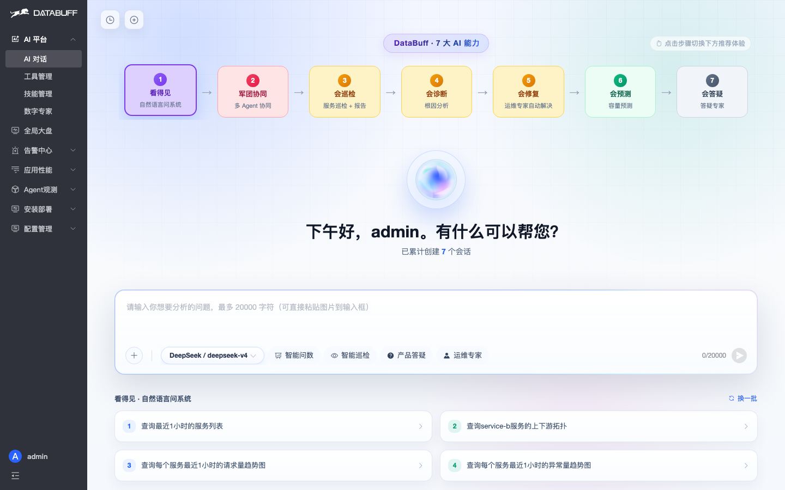

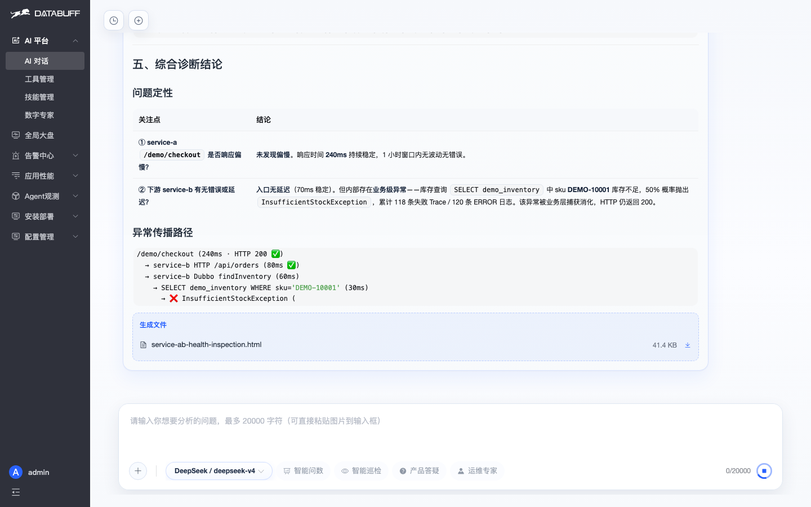

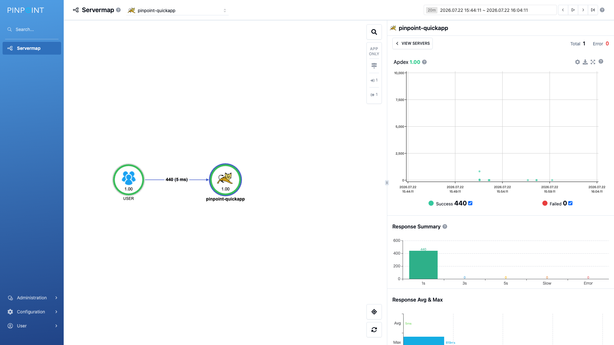

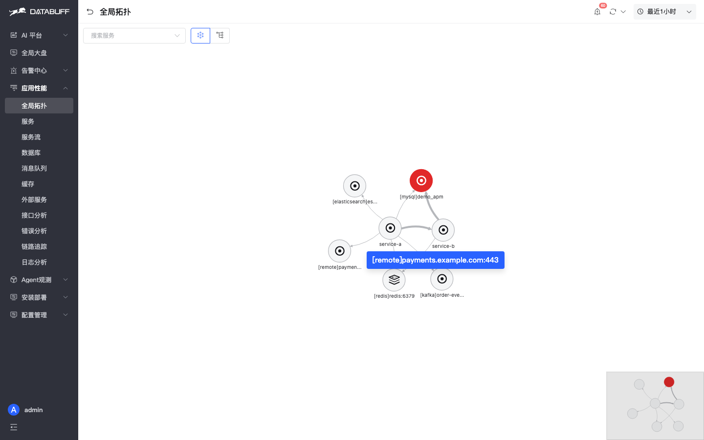

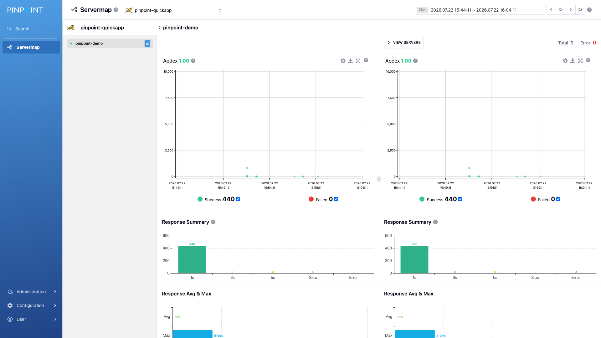

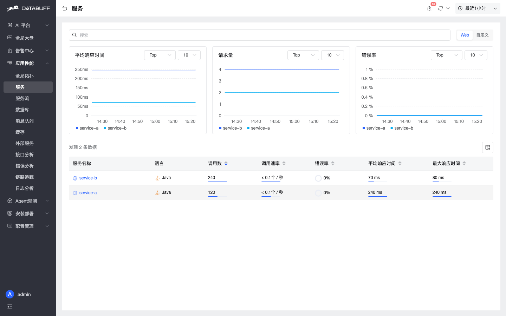

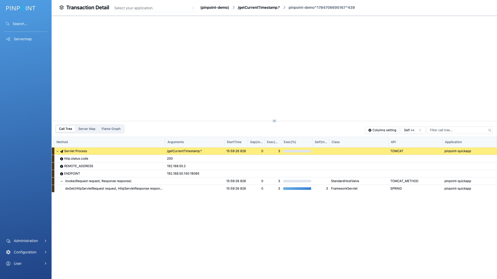

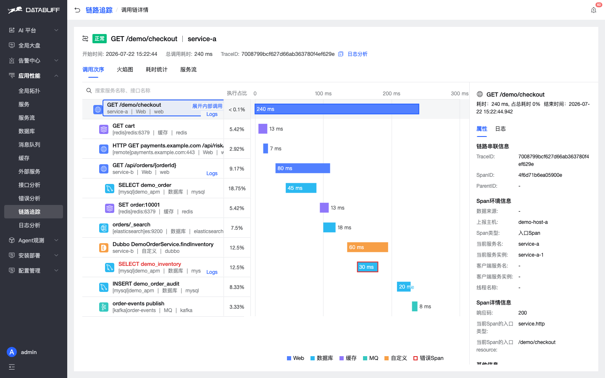

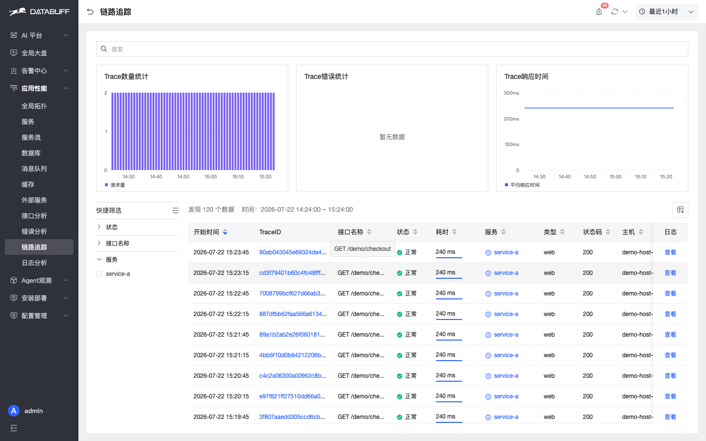

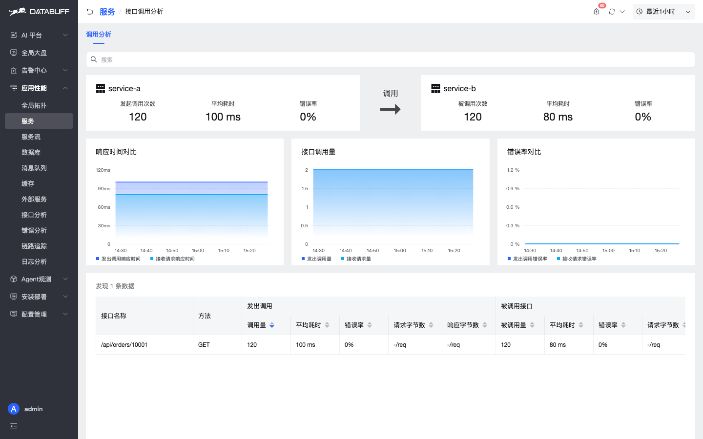

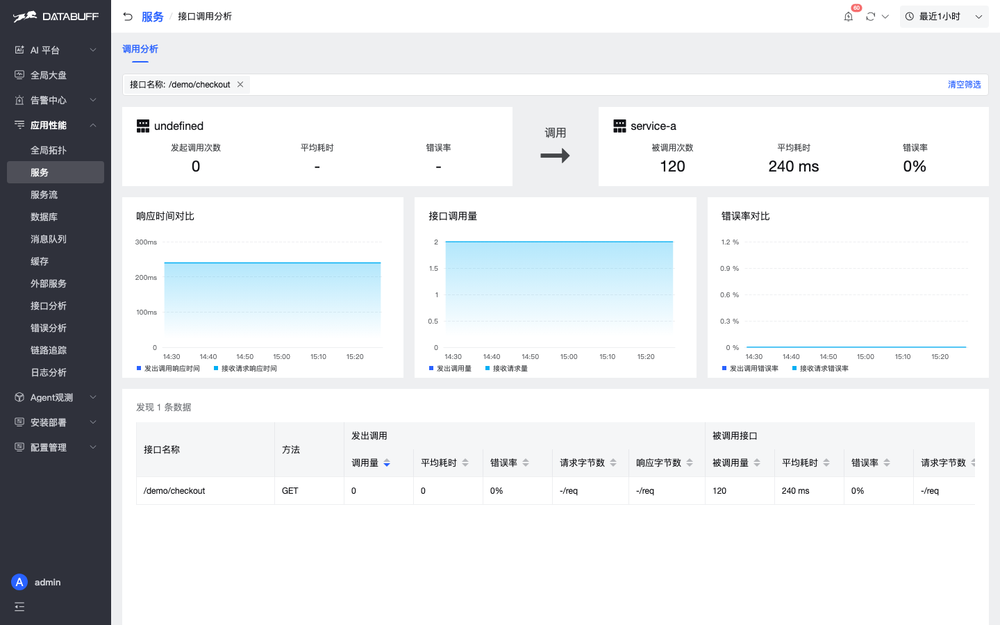

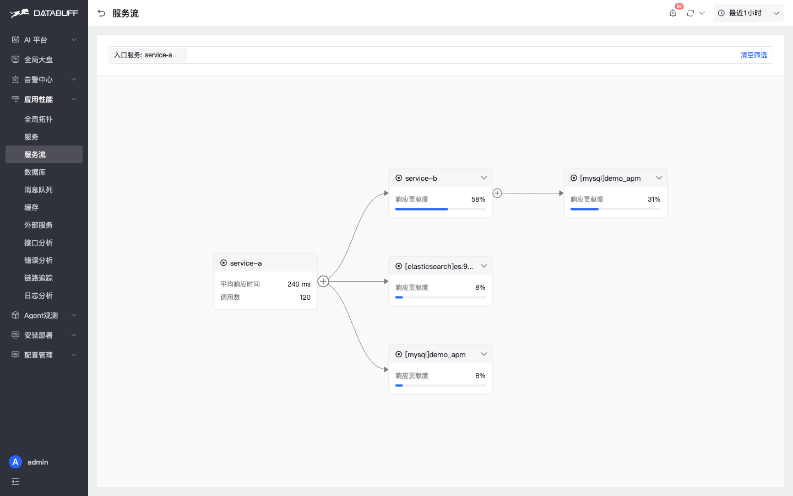

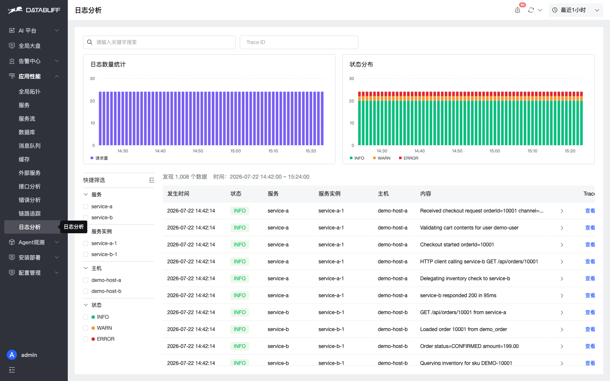

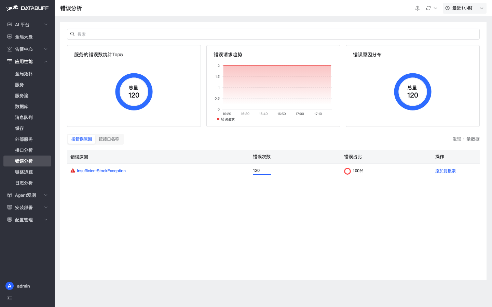

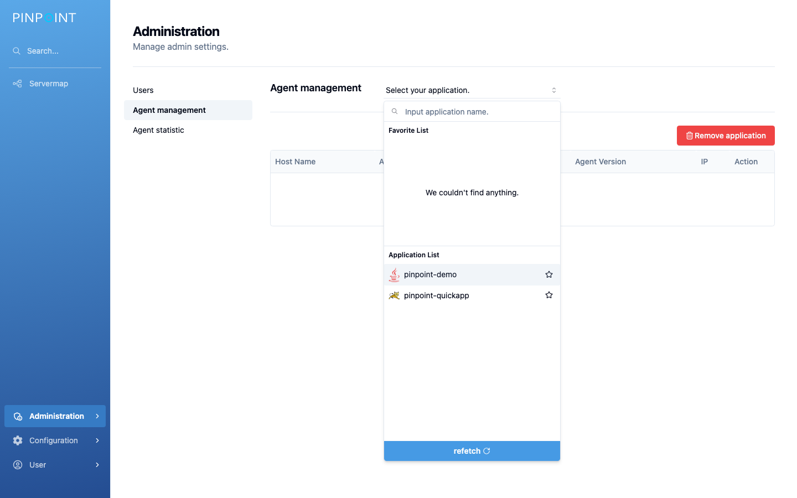

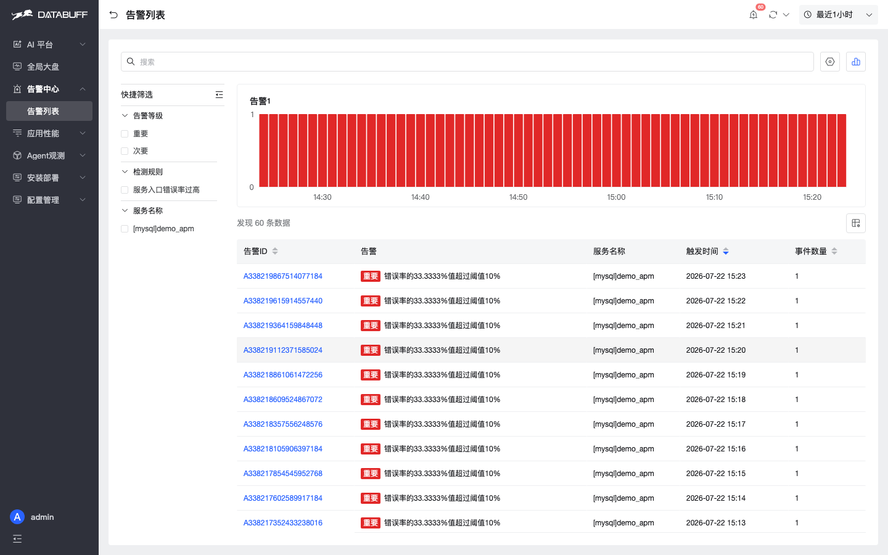

## Further reading

- [Docker install](/docs/en/guide/docker-install)
- [Java OTel agent](/docs/en/manual/agent-integration)
- [Migrate from Pinpoint](/docs/en/migration/from-pinpoint) (coming soon)

Star us: https://github.com/databufflabs/databuff
