# DataBuff vs SigNoz

> Comparison · [中文](./vs-signoz.md)

Same-host lab on `192.168.50.140`: **DataBuff v0.1.4** vs **SigNoz v0.133.0**, same Demo (`service-a` / `service-b`). DataBuff uses OTLP `:4318`; SigNoz uses OTLP `:24318`. Marks: ✅ verified in this lab · △ present but limited · ❌ no equivalent.

Full HTML article with screenshots: [DataBuff vs SigNoz (lab compare)](https://databuff.ai/blog/en/databuff-vs-signoz)

## 1. Capability matrix

**Seven AI capabilities** (v0.1.4: See → Squad → Inspect → Diagnose → Repair → Predict → Answer)

| Capability | SigNoz v0.133.0 | DataBuff v0.1.4 |
|------------|-----------------|-----------------|
| ① See · natural-language questions | ❌ | ✅ Ask about services / topology / trends; AI reads telemetry |
| ② Squad · multi-agent collaboration | ❌ | ✅ Parallel evidence gathering; reusable task orchestration |
| ③ Inspect · service inspection + report | ❌ | ✅ One-shot inspection with evidence and actions |
| ④ Diagnose · bottleneck / RCA evidence | ❌ | ✅ Trace / metrics / topology evidence |
| ⑤ Repair · Ops Expert actions | ❌ | ✅ Repair under policy + human approval |
| ⑥ Predict · capacity / trends | ❌ | ✅ Capacity and trend analysis |
| ⑦ Answer · product Q&A | ❌ | ✅ Answers deploy / ingest / config from docs and code |
| Extend · MCP / Skill / custom experts | ❌ | ✅ External MCP / Skill and custom digital experts |

Largest gap: SigNoz home is Traces / Metrics / Logs Explorer — no AI platform.

**APM**

| Capability | SigNoz v0.133.0 | DataBuff v0.1.4 |
|------------|-----------------|-----------------|
| 1. Global topology | ✅ Service Map (incl. middleware nodes) | ✅ Topology + health colors + drill-down |
| 2. Service list & golden metrics | ✅ Services (P99 / Error / OPS) | ✅ Service list + charts |
| 3. Service-level topology | △ Via Service Map only | ✅ Dedicated service topology |
| 4. Service call analysis (up/downstream + Trace) | ❌ | ✅ |
| 5. Instance golden metrics | ❌ | ✅ Instance charts / list |
| 6. Instance topology | ❌ | ✅ |
| 7. Instance call analysis | ❌ | ✅ |
| 8. Endpoint topology | ❌ | ✅ |
| 9. Endpoint call analysis | ❌ Mostly Traces filters | ✅ |
| 10. Service flow | ❌ Map answers “who connects” | ✅ Response contribution from entry |
| 11. Middleware / external pages | ❌ Nodes only | ✅ DB / cache / MQ / external pages |
| 12. Error analysis | ❌ Mostly Traces filters | ✅ |
| 13. Trace list / search | ✅ Traces Explorer | ✅ |
| 14. Trace detail | ✅ | ✅ |
| 15. Trace Span → logs | ✅ From Trace detail | ✅ |
| 16. Log list / search | ✅ Logs Explorer | ✅ |
| 17. Log detail | ✅ | ✅ |
| 18. Log → Trace | ✅ | ✅ Down to Span |
| 19. Custom dashboards | ✅ Dashboards V2 (Perses / PromQL) | ❌ Not yet |

**Alerting**

| Capability | SigNoz v0.133.0 | DataBuff v0.1.4 |
|------------|-----------------|-----------------|
| How rules are configured | ✅ Alert Rules UI | ✅ Alert center |
| Threshold alerts | ✅ | ✅ |
| Period-over-period (WoW/MoM) alerts | ❌ | ✅ |
| Alert event list | ✅ Triggered Alerts; firing in this lab | ✅ Non-empty |
| Alerts linked to service / middleware | △ Notifications; stitch APM yourself | ✅ List links into APM |

**When to pick which**

| Scenario | Better fit | Note |
|----------|------------|------|
| Same OTel data, want AI / APM pages first | DataBuff (side-by-side) | Point OTLP at DataBuff |
| Need the seven AI capabilities | DataBuff | No SigNoz AI platform |
| MCP / Skill / custom experts | DataBuff | No such layer in SigNoz |
| See who slows the entry response | DataBuff | Service flow |
| Call analysis → Trace | DataBuff | No SigNoz path |
| Slow SQL / cache / MQ pages | DataBuff | SigNoz mostly map nodes |
| Custom dashboards / PromQL boards | SigNoz | DataBuff not yet |
| Mature Trace / Logs Explorer only | Either / lean SigNoz | No need to migrate for brand |

**Boundary:** Deep SigNoz Dashboard / PromQL workflows → stay on SigNoz. DataBuff fits same OTel data + AI + APM depth, side-by-side or gradual switch.

## 2. Screenshot evidence (explains the tables)

Screenshots from **192.168.50.140**.

**Seven AI capabilities**

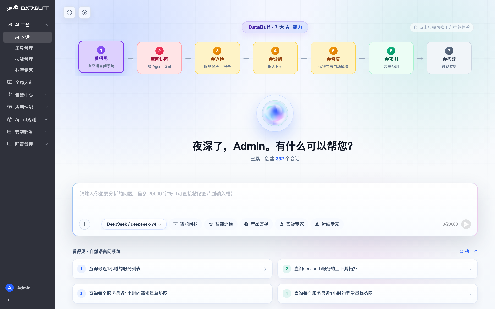

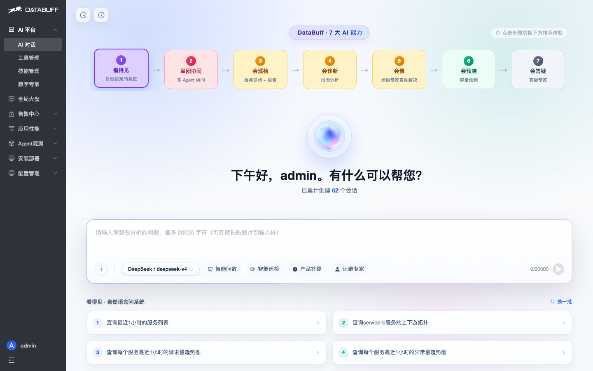

**Services & topology**

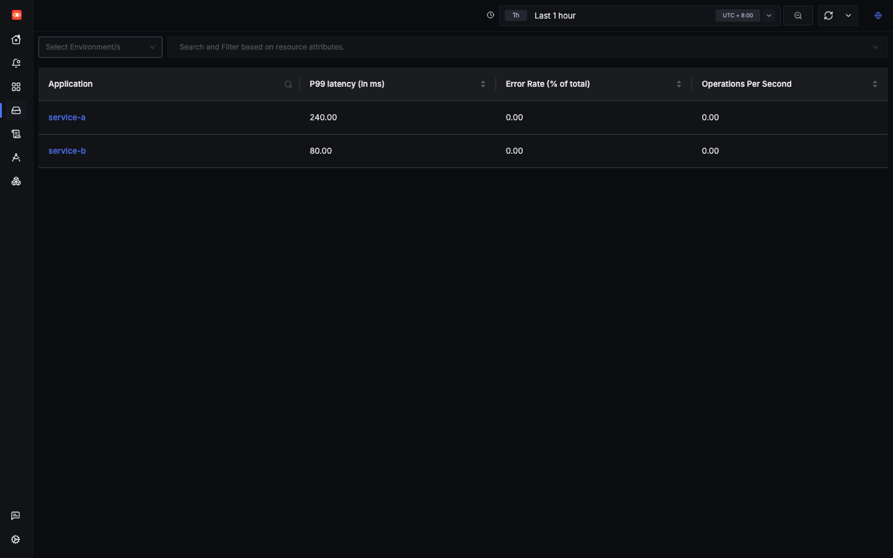

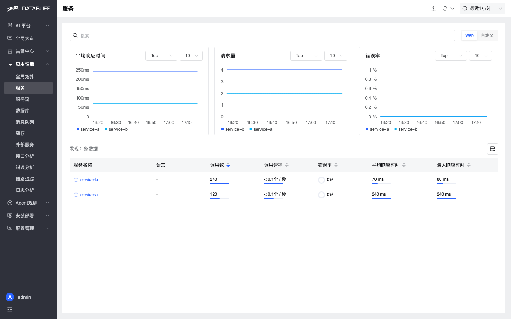

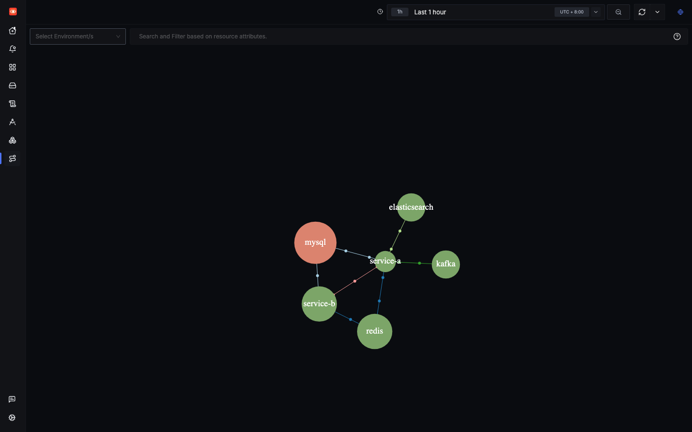

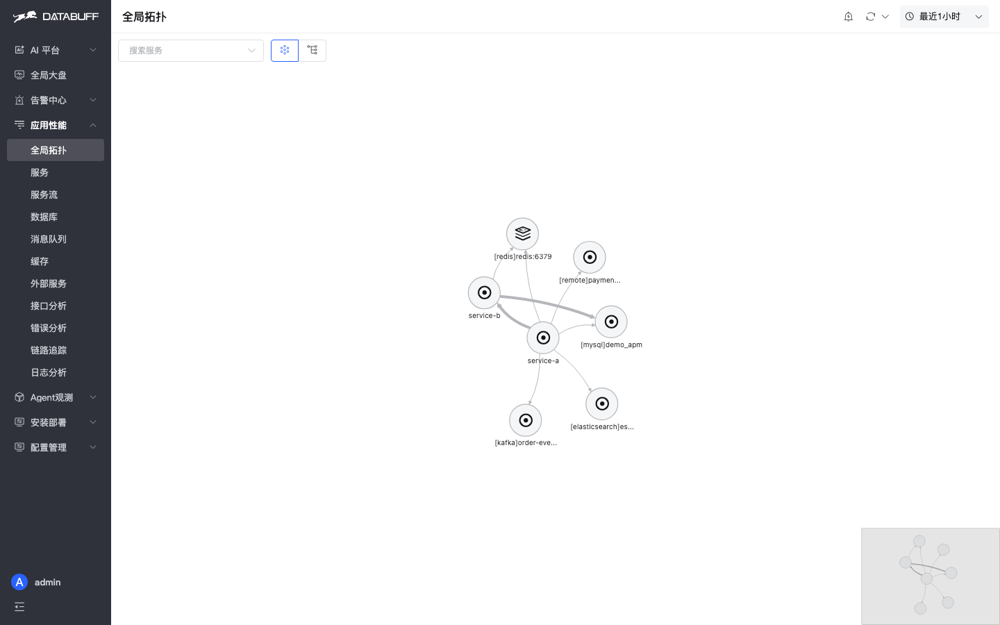

**Call analysis & service flow**

**Trace**

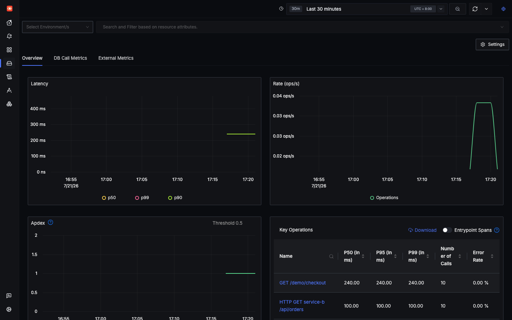

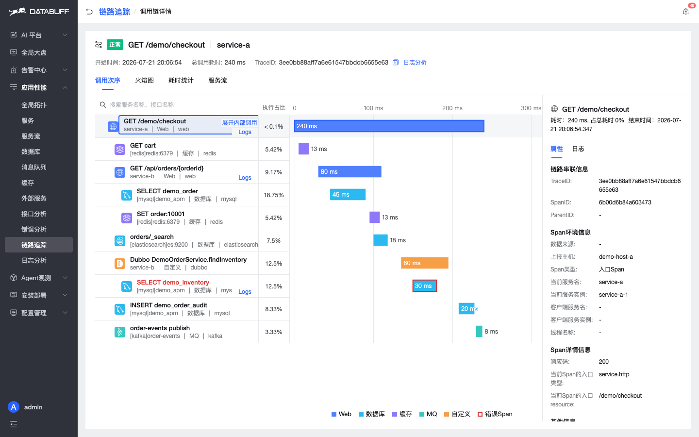

**Log**

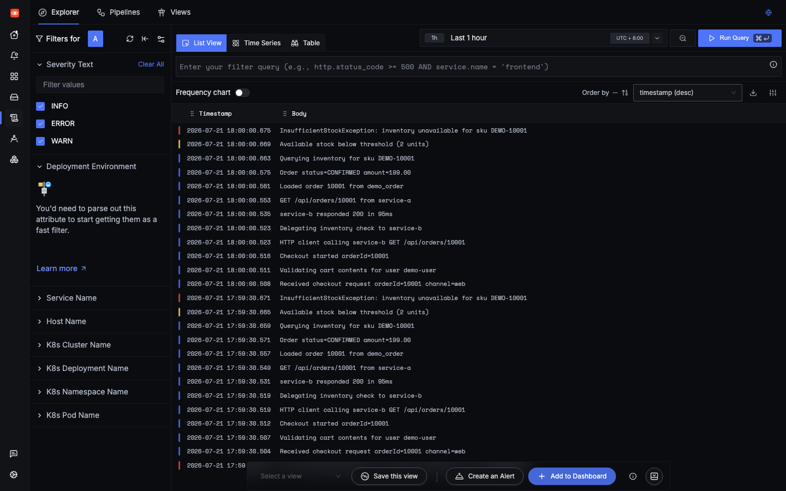

**Dashboards (SigNoz strength)**

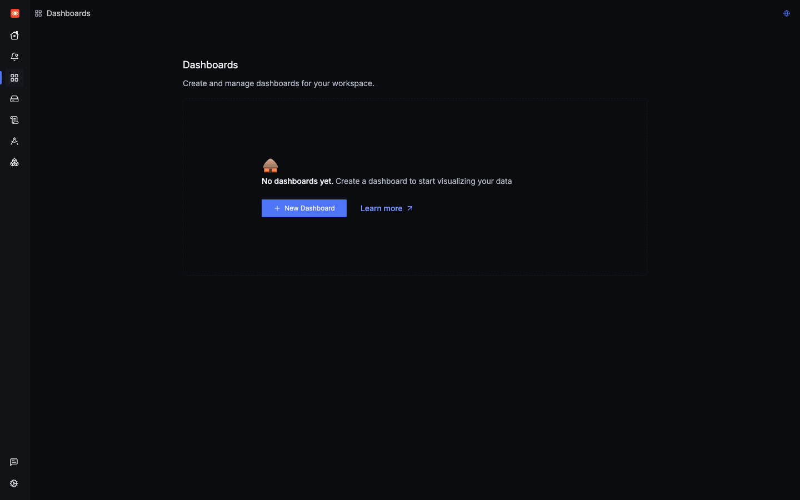

**DataBuff dedicated pages**

**Alerting**

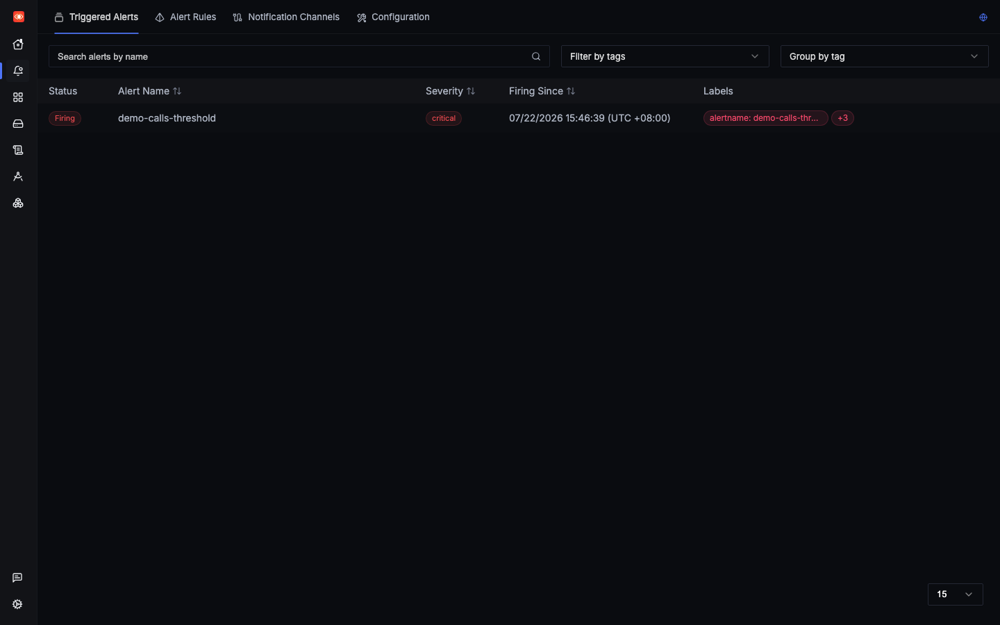

## Further reading

- [Migrate from SigNoz](/docs/en/migration/from-signoz) (coming soon)

Star us: https://github.com/databufflabs/databuff
