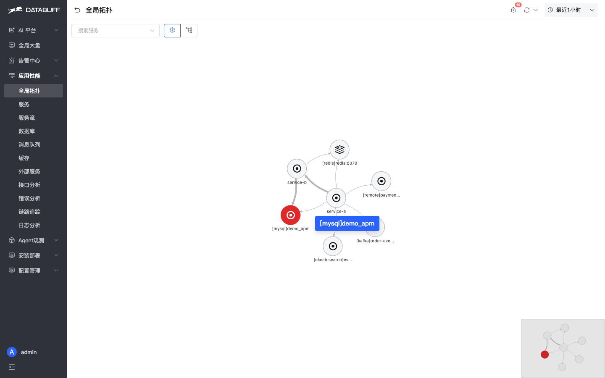
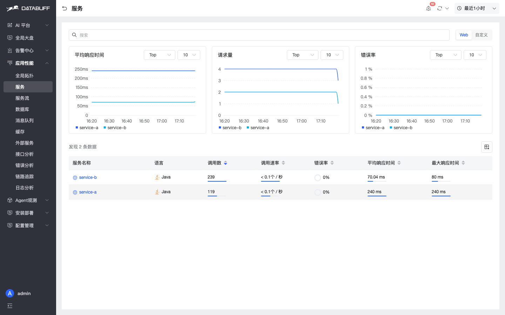
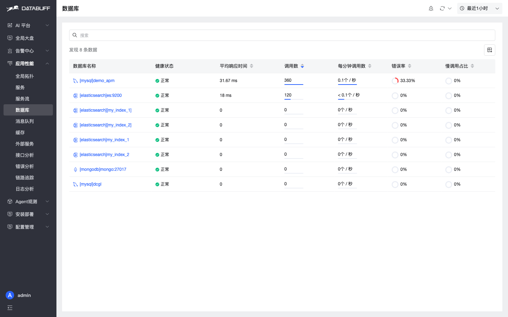
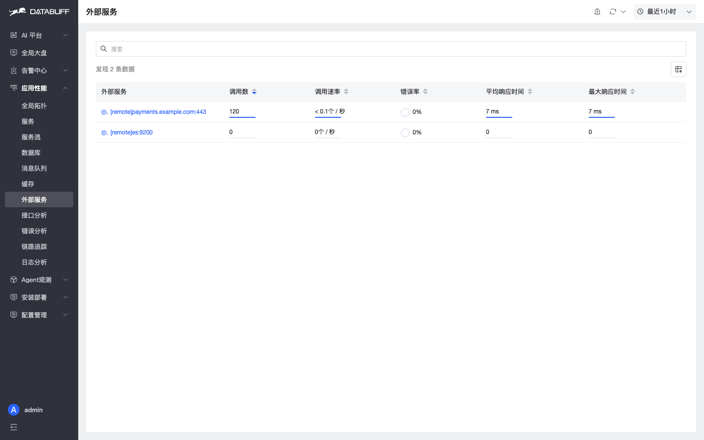
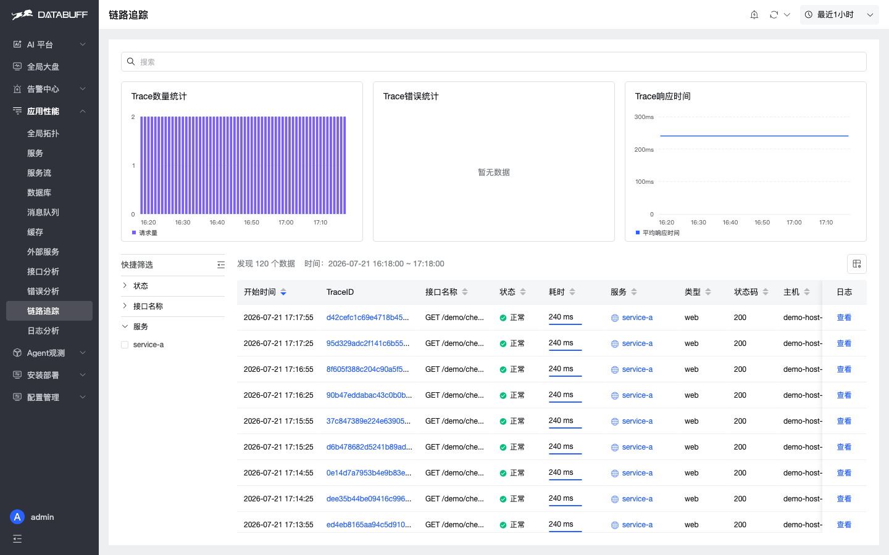
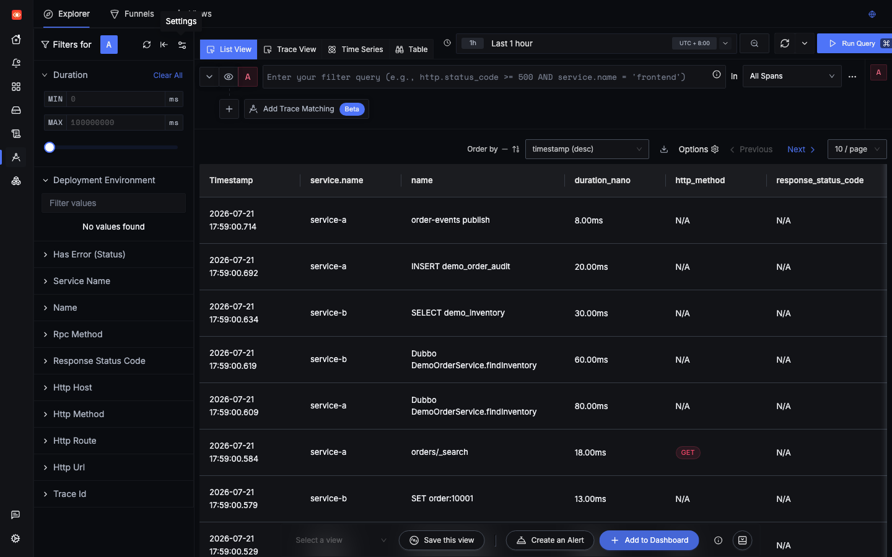
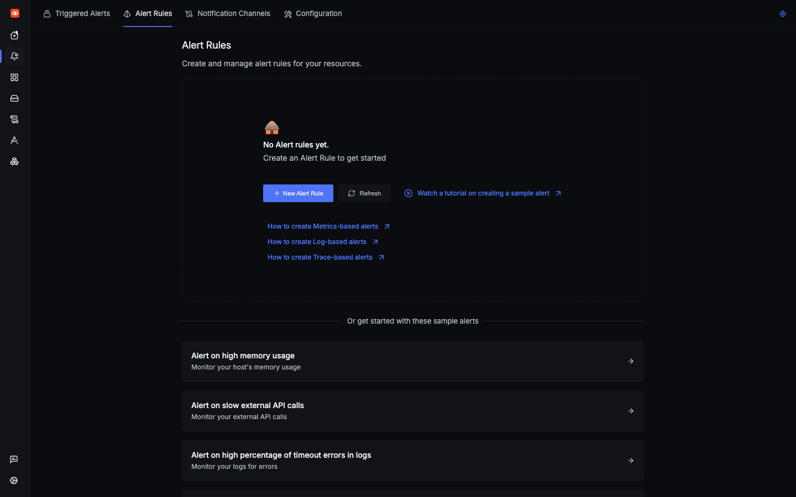

# DataBuff vs SigNoz

> Objective comparison · [Switch to Chinese](./vs-signoz.md)

Side-by-side comparison based on the same environment: two independent `ai-apm-demo` containers sending identical OTLP HTTP data (service-a → service-b call chain with MySQL / Redis / Kafka / ES / external HTTP) to DataBuff (v0.1.4, Doris storage) and SigNoz (v0.133.0, ClickHouse 25.12.5 storage). Server: 192.168.50.140 (8 cores / 32GB RAM). Both products are open source.

## Capability Boundary

| Dimension | SigNoz | DataBuff |
|-----------|--------|----------|
| **Positioning** | OTel backend (Traces + Metrics + Logs) | AI Native OTel APM (Trace + Metrics + Log + AI) |
| **AI Capability** | ❌ No built-in AI | ✅ AI chat troubleshooting, smart query, smart inspection, digital experts |
| **APM Modules** | Services / Traces / Service Map / Logs / Dashboards | 12+ dedicated pages: topology/services/database/cache/MQ/external/API/errors/traces/logs/AI platform |
| **Middleware Pages** | ❌ No dedicated pages (Service Map can show middleware nodes) | ✅ Database / Cache / MQ / External Service dedicated pages |
| **Built-in Storage** | ClickHouse 25.12.5 | Doris 4.1.1 (columnar storage) |
| **Deployment** | Docker Compose / Foundry / K8s | Docker Compose / K8s |
| **Protocol Support** | OTLP gRPC + HTTP | OTel + SkyWalking gRPC + Jaeger Thrift |
| **Alerting** | ✅ Built-in Alertmanager | ✅ Built-in alert rules |
| **Dashboards** | ✅ Dashboards V2 (Perses) | ✅ Built-in dashboards + custom |
| **Open Source** | ✅ | ✅ |

## Objective Differences

### 1. AI: DataBuff has it, SigNoz doesn't

This is the most significant gap. DataBuff includes a **full AI platform** where APM data serves as AI context, enabling natural language troubleshooting across the entire topology → metrics → traces pipeline. SigNoz v0.133.0 home page only offers Traces / Metrics / Logs Explorer entry points.

DataBuff AI platform provides preset quick questions like "list services", "show topology", "check trends", and "find anomalies".

The **Digital Expert** system makes APM troubleshooting orchestrated and reusable—a capability layer entirely absent in SigNoz.

### 2. APM Module Breadth

DataBuff offers 12+ dedicated menu items under "APM", with specialized pages for each middleware type and analysis scenario. SigNoz compresses equivalent information into Services / Traces / Service Map.

| Module | DataBuff | SigNoz |
|--------|----------|--------|
| Global Topology | ✅ Virtual nodes (MySQL/Redis/Kafka/ES/External) | △ Service Map can show middleware nodes; no dedicated drill-down pages |
| Service List/Detail | ✅ Upstream/downstream + instances + API drill-down | △ Service list table |
| Database | ✅ Dedicated page + slow SQL drill-down | ❌ No dedicated page |
| Cache | ✅ Dedicated page | ❌ No dedicated page |
| Message Queue | ✅ Dedicated page | ❌ No dedicated page |
| External Service | ✅ Dedicated page | ❌ No dedicated page |
| API Analysis | ✅ Aggregated P99 / error rate per endpoint | △ Must filter in Traces |
| Error Analysis | ✅ Error clustering | △ Must filter in Traces |
| Logs | △ Log panel (still being enhanced) | ✅ Logs Explorer |

### 3. Global Topology vs Service Map

DataBuff automatically identifies virtual service nodes like `[mysql]` `[redis]` `[kafka]` `[elasticsearch]` and `[remote]`, providing a complete call chain in one view with drill-down into middleware pages.

SigNoz Service Map **also shows** middleware nodes such as `mysql` / `redis` / `kafka` / `elasticsearch` (verified in screenshots; mysql can appear highlighted). The gap is depth: DataBuff provides dedicated middleware pages (slow SQL, cache, MQ, external HTTP) and richer topology interactions; SigNoz stays at graph-level dependencies without equivalent page drill-downs.

### 4. Service Views

DataBuff service list supports click-through to service detail pages (instances, API analysis, service flow).

SigNoz Services is a table-level view with P99 / Error Rate / OPS, lacking an aggregated service detail page.

### 5. Middleware Pages (DataBuff Exclusive)

The same Demo's MySQL / Redis / Kafka / external HTTP calls are automatically split into independent monitoring targets in DataBuff.

SigNoz receives the same traces and can show middleware nodes on the Service Map, but **has no dedicated middleware pages**.

### 6. API Analysis & Error Analysis

DataBuff aggregates P99 latency / request volume / error rate per endpoint for quick bottleneck identification.

DataBuff error analysis automatically clusters by exception type without requiring hand-written ClickHouse SQL.

### 7. Trace Explorer

Both platforms offer feature-equivalent Traces Explorers with filtering by service name, operation, and time range. Live screenshots show real service-a / service-b spans.

### 8. Logs

This demo sends application logs to SigNoz; Logs Explorer can retrieve real checkout / inventory entries. DataBuff's log panel is still being enhanced, so logs are not the primary comparison axis here.

### 9. Alerting

Both platforms expose built-in alerting engines. This demo environment does not pre-configure production-grade alert rules, so we avoid overstating "out-of-the-box alerting".

## When to Choose Which

| Scenario | Recommendation | Rationale |
|----------|---------------|-----------|
| Need AI-driven troubleshooting | **DataBuff** | AI-native APM with natural language support |
| Pure OTel trace / log storage & query | **SigNoz** | Lightweight OTel backend with mature Traces/Logs Explorer |
| Multi-middleware performance analysis | **DataBuff** | Dedicated database/cache/MQ/external pages out of the box |
| Existing SkyWalking Agent | **DataBuff** | Native SW gRPC protocol support, no Agent change needed |
| Prometheus ecosystem integration | **SigNoz** | Dashboards V2 with Perses/PromQL support |
| Prefer open source | Either | Both are open source — choose by feature depth |

## When NOT to Use

- **SigNoz**: Not suitable for scenarios requiring APM depth analysis (database/cache/MQ details) or AI-automated troubleshooting; debugging depends more on manual ClickHouse SQL or PromQL.
- **DataBuff**: Not suitable for teams that need only lightweight Trace/Logs storage/query and do not need AI or middleware pages; log panel is still being enhanced.

## Try It

Star DataBuff or try the live demo:

- GitHub: https://github.com/databufflabs/databuff
- Live Demo: https://demo.databuff.ai (account admin / Databuff@123)

## See Also

- [Comparison Overview](./总览_en.md)
- [Migration: From SigNoz to DataBuff](/docs/en/migration/from-signoz) (Coming Soon)
