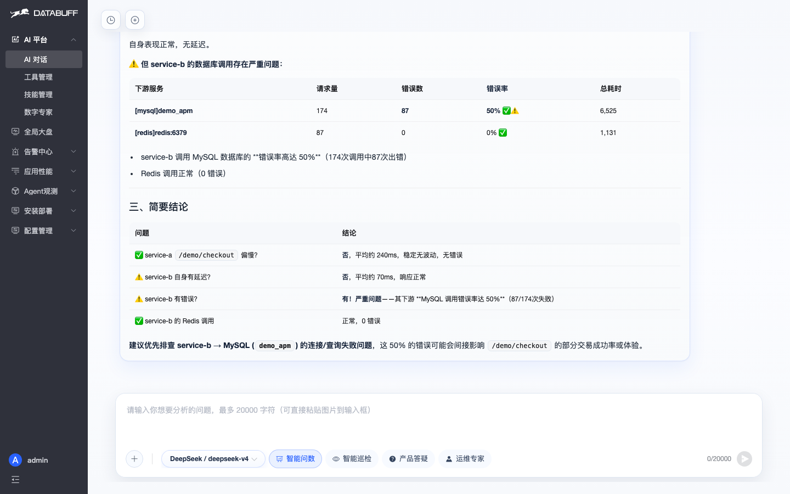
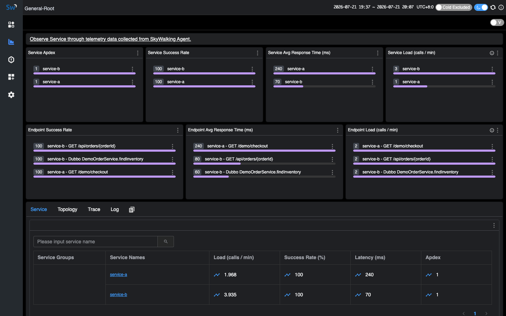
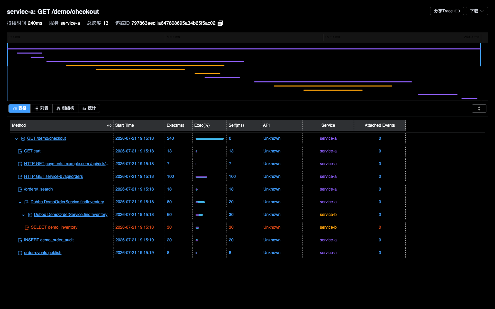
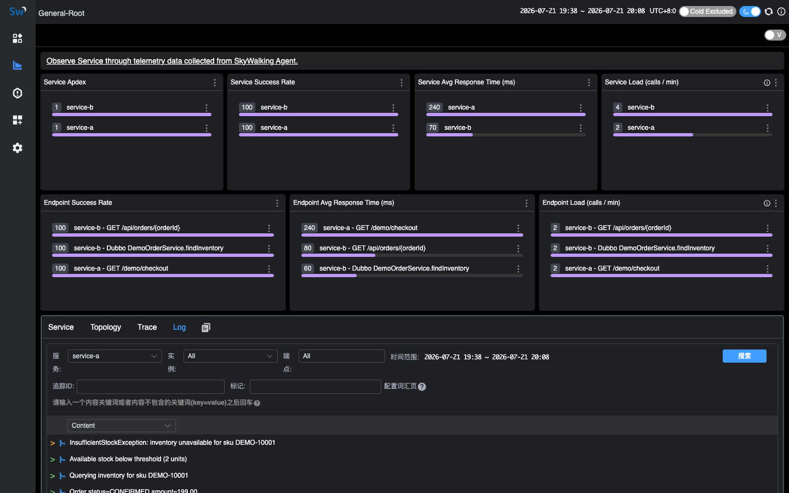
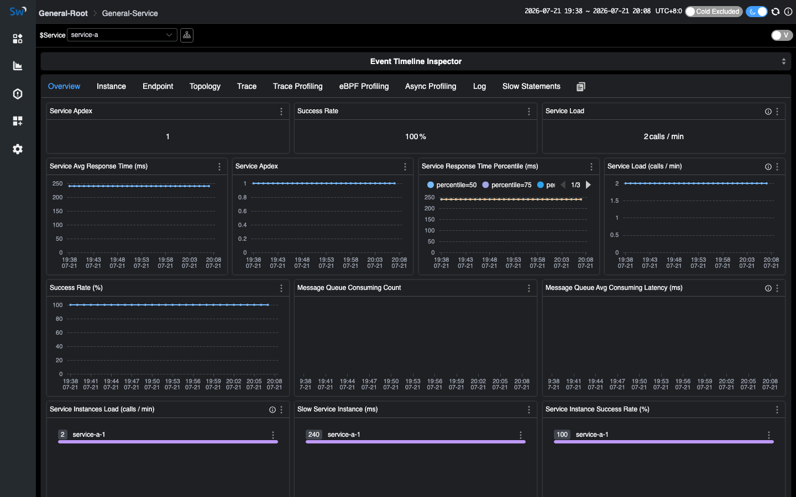
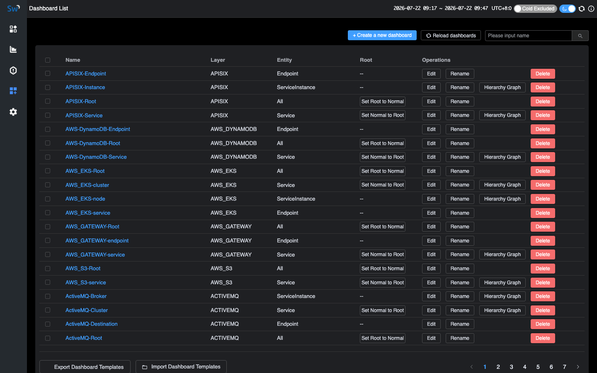
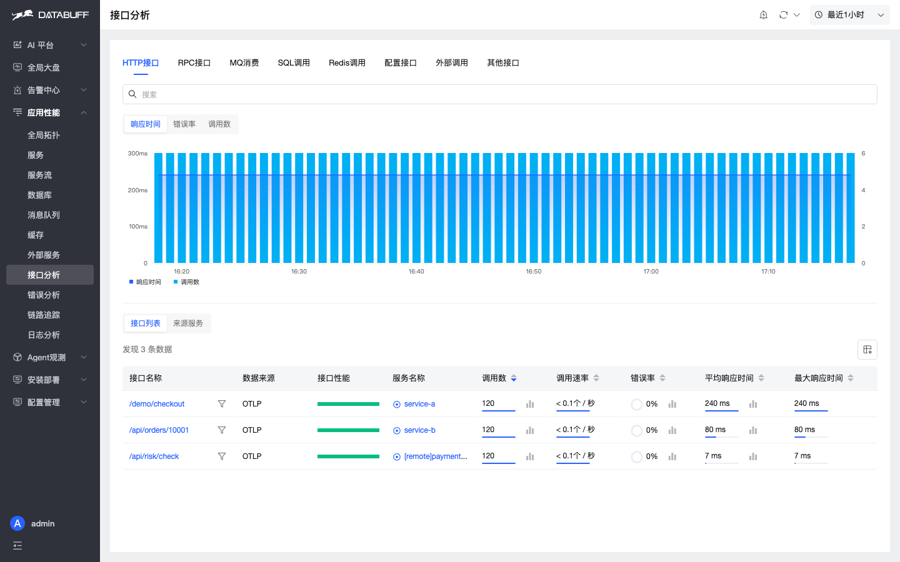
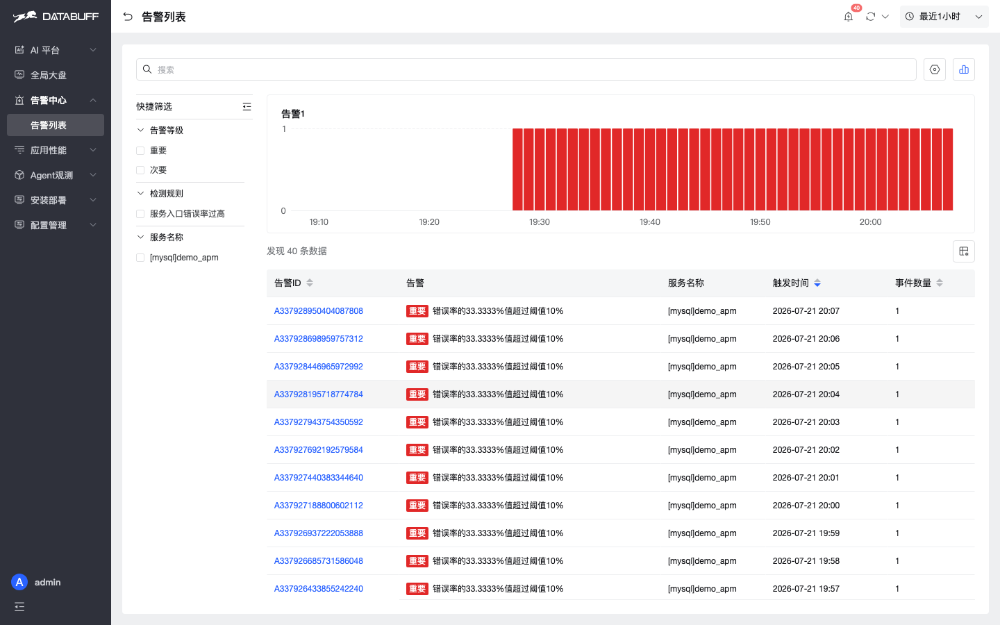

# DataBuff vs SkyWalking

Same-host lab on `192.168.50.140`: **DataBuff v0.1.4** vs **SkyWalking 10.4.0**, same Demo (`service-a` / `service-b`). DataBuff uses OTLP `:4318`; SkyWalking uses Agent gRPC `:31180`. Marks: ✅ verified in this lab · △ present but limited · ❌ no equivalent.

## 1. Capability matrix

**Seven AI capabilities** (v0.1.4: See → Squad → Inspect → Diagnose → Repair → Predict → Answer)

| Capability | SkyWalking 10.4.0 | DataBuff v0.1.4 |
|------------|-------------------|-----------------|
| ① See · natural-language questions | ❌ | ✅ Ask about services / topology / trends; AI reads telemetry |
| ② Squad · multi-agent collaboration | ❌ | ✅ Parallel evidence gathering; reusable task orchestration |
| ③ Inspect · service inspection + report | ❌ | ✅ One-shot inspection with evidence and actions |
| ④ Diagnose · bottleneck / RCA evidence | ❌ | ✅ Trace / metrics / topology evidence (not a black-box “root cause”) |
| ⑤ Repair · Ops Expert actions | ❌ | ✅ Repair under policy + human approval; dangerous-command denylist |
| ⑥ Predict · capacity / trends | ❌ | ✅ Capacity and trend analysis — from after-the-fact to ahead-of-time |
| ⑦ Answer · product Q&A | ❌ | ✅ Answers deploy / ingest / config from docs and code |
| Extend · MCP / Skill / custom experts | ❌ | ✅ External MCP / Skill and custom digital experts |

Largest gap: SkyWalking has no equivalent AI platform; DataBuff exposes the seven capabilities as configurable home entries with APM as AI context.

**APM**

| Capability | SkyWalking 10.4.0 | DataBuff v0.1.4 |
|------------|-------------------|-----------------|
| 1. Global topology | ✅ Topology (incl. middleware nodes) | ✅ Topology + health colors + drill-down |
| 2. Service list & golden metrics | ✅ Apdex / success / latency / Load | ✅ Service list + charts; same demo shows service-a / b |
| 3. Service-level topology | ✅ | ✅ |
| 4. Service call analysis (up/downstream + Trace) | ❌ | ✅ Upstream/downstream structure, latency/contribution; drill to Trace |
| 5. Instance golden metrics | ✅ Instance metrics | ✅ Instance golden-metric charts / list |
| 6. Instance topology | ❌ | ✅ Dedicated instance topology |
| 7. Instance call analysis (up/downstream + Trace) | ❌ | ✅ Per-instance up/downstream + Trace |
| 8. Endpoint topology | ❌ | ✅ Dedicated endpoint topology |
| 9. Endpoint call analysis (up/downstream + Trace) | ❌ | ✅ Per-endpoint caller/callee + Trace |
| 10. Service flow (service / endpoint Trace contribution) | ❌ Topology answers “who connects”, no service flow | ✅ Response contribution from entry; service / endpoint Trace view |
| 11. Middleware / external pages (DB / cache / MQ / external) | ❌ Nodes only, no dedicated depth | ✅ Dedicated pages: DB / cache / MQ / external |
| 12. Error analysis (stats + endpoint) | ❌ | ✅ Error stats + endpoint drill-down |
| 13. Trace list / search | ✅ Service / endpoint / status / latency filters | ✅ Charts + list, multi-dimension filters |
| 14. Trace detail | ✅ Span timeline / Tags | ✅ Call-order waterfall + Span attributes |
| 15. Trace Span → logs | ✅ Trace / Span can link to logs | ✅ Top “Log analysis” + Span Logs / Logs tab |
| 16. Log list / search | ✅ | ✅ |
| 17. Log detail | ✅ | ✅ |
| 18. Log → Trace | ✅ Log → Trace | ✅ Log → Trace, down to Span |
| 19. Profiling (Tracing / AsyncProfiler / eBPF) | ✅ All three | ❌ Not yet |
| 20. Custom dashboards | ✅ Built-in; service + middleware boards | ❌ Not yet |

Basics (incl. Span↔logs) exist on both sides; DataBuff leads on call analysis, instance/endpoint topology, service flow, dedicated pages and error depth, and Log→Trace down to Span. Profiling and custom dashboards are SkyWalking strengths DataBuff does not cover yet.

**Alerting**

| Capability | SkyWalking 10.4.0 | DataBuff v0.1.4 |
|------------|-------------------|-----------------|
| How rules are configured | △ OAP `alarm-settings.yml` (or dynamic config); not built in UI | ✅ Alert center in product |
| Threshold alerts | △ Supported via YAML / MQE | ✅ Managed in platform |
| Smart alerts | ❌ | ✅ Linked with APM metrics |
| Alert event list | △ UI exists; empty in this lab | ✅ Non-empty in this lab |
| Alerts linked to service / middleware | △ Mostly hooks; stitch APM yourself | ✅ List links back into APM |

Gaps are at both ends: **how to configure** (backend file vs alert center) and **what you can do after** (events / hooks vs list + smart alerts + service context).

**When to pick which**

| Scenario | Better fit | Note |
|----------|------------|------|
| Keep SW Agents, want AI / dedicated pages first | DataBuff (side-by-side) | Point ingest at DataBuff |
| Need the seven AI capabilities | DataBuff | No SW AI platform |
| MCP / Skill / custom experts | DataBuff | SW has no such layer |
| See who slows the entry response | DataBuff | Service flow + contribution |
| Call analysis → Trace (service / instance / endpoint) | DataBuff | No SW path |
| Slow SQL / cache / MQ pages | DataBuff | SW mostly topology nodes |
| Tracing / AsyncProfiler / eBPF Profiling | SkyWalking | DataBuff not yet |
| Custom dashboards / middleware boards | SkyWalking | DataBuff not yet |
| Lightweight Trace only, no AI | Either | No need to migrate for brand |

**Boundary:** Deep SW plugin lock-in or hard need for Profiling / custom dashboards → stay on SkyWalking. DataBuff fits keep-Agent + AI + APM depth, side-by-side or gradual switch.

## 2. Screenshot evidence (explains the tables)

Screenshots from **192.168.50.140** (AI home matches v0.1.4 product entry). Captions map to capability rows. Focus on DataBuff extras: seven AI capabilities / dedicated pages / alerting. Profiling is a SkyWalking strength (no filler screenshot here); custom dashboards shown via SkyWalking below — DataBuff has no equivalent yet.

**Seven AI capabilities** (SkyWalking has no equivalent UI; DataBuff evidence)

**Services & topology**

**Service / instance / endpoint call analysis + service flow** (rows 4 / 7 / 9 / 10)

SkyWalking has global/service topology and instance metrics, but **no** service / instance / endpoint call analysis (with up/downstream metrics and Trace), and **no** instance/endpoint topology or service-flow Trace contribution view. DataBuff can drill to Trace on rows 4, 7, 9; service flow (10) expands from entry `service-a` with downstream **response contribution** (e.g. service-b ~58%).

**Trace**

**Log / Metric** (linkage granularity)

**Dashboards** (row 20; SkyWalking strength)

**DataBuff dedicated pages** (DB / cache / MQ / external / API / errors; no SW equivalent pages)

These pages are the depth after “middleware appears on topology” — the APM difference most worth validating side-by-side.

**Alerting**

## Further reading

- [SkyWalking ingestion](/docs/en/manual/skywalking-ingestion)
- [Migrate from SkyWalking](/docs/en/migration/from-skywalking) (coming soon)

Star us: https://github.com/databufflabs/databuff
