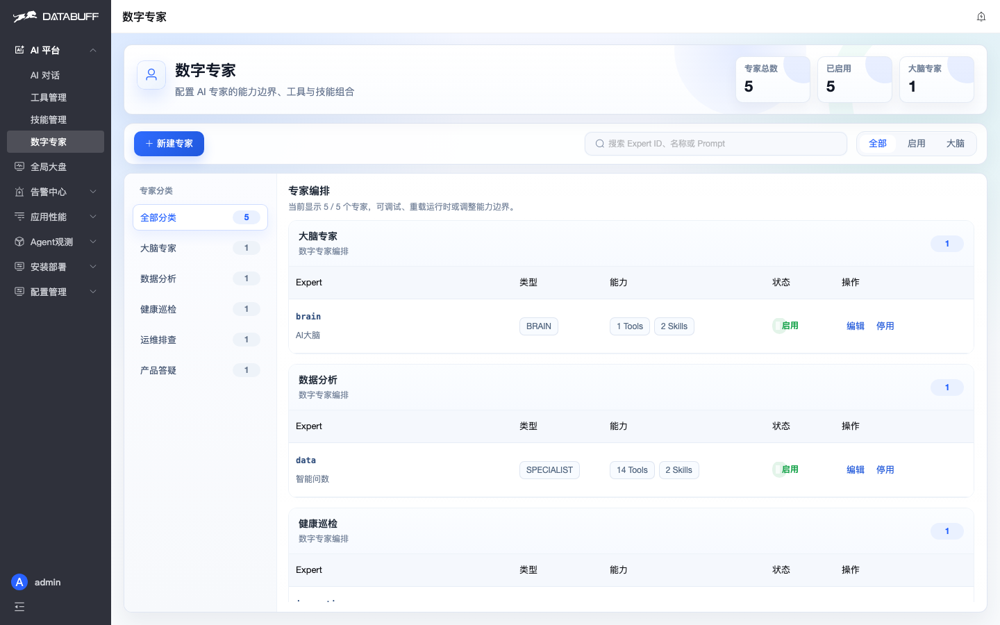
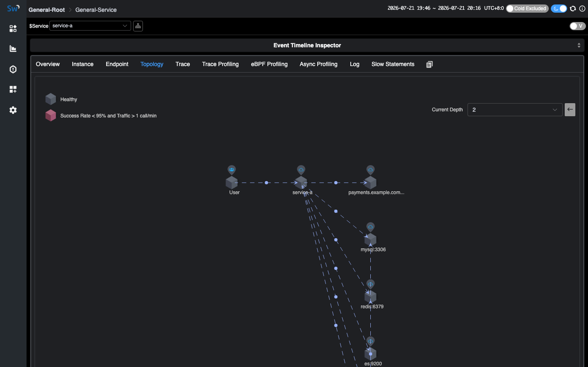
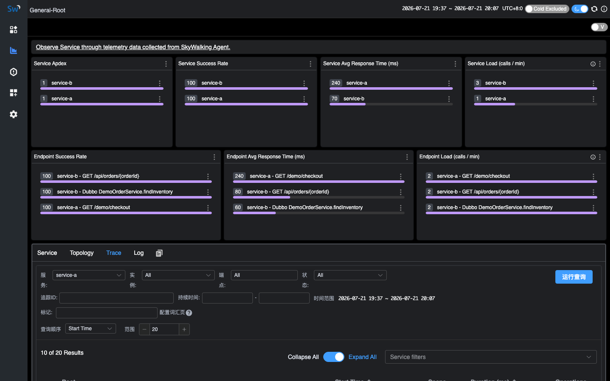
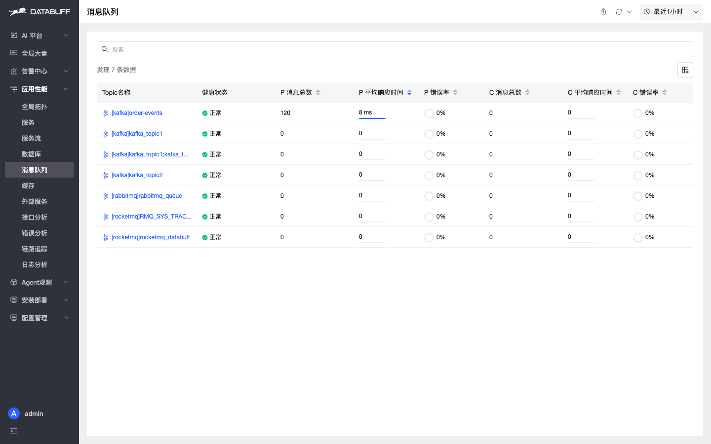
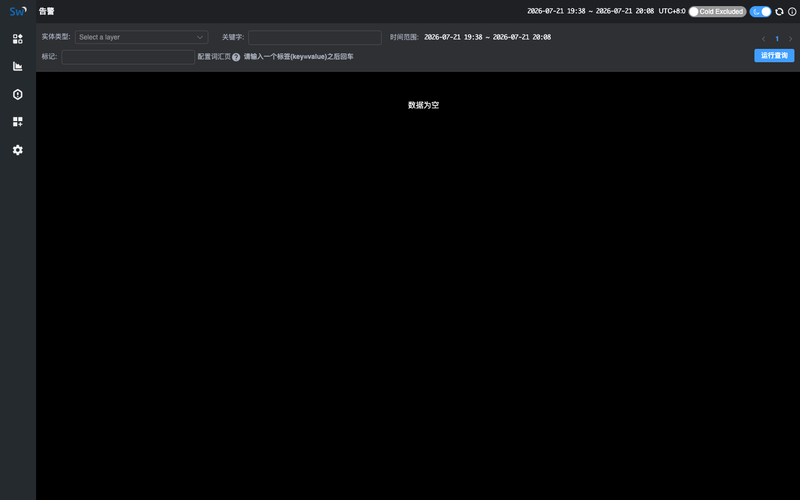

# DataBuff vs SkyWalking

> Comparison · [中文](./vs-skywalking.md)

Same-host lab on `192.168.50.140`: **DataBuff v0.1.4** vs **SkyWalking 10.4.0**, same Demo (`service-a` / `service-b`). DataBuff uses OTLP `:4318`; SkyWalking uses Agent gRPC `:31180`. Marks: ✅ verified in this lab · △ present but limited · ❌ no equivalent.

Full HTML article with screenshots: [DataBuff vs SkyWalking (lab compare)](https://databuff.ai/blog/databuff-vs-skywalking)

## Seven AI capabilities

| Capability | SkyWalking 10.4.0 | DataBuff v0.1.4 |
|------------|-------------------|-----------------|
| ① See · natural-language questions | ❌ | ✅ Ask about services / topology / trends; AI reads telemetry |
| ② Squad · multi-agent collaboration | ❌ | ✅ Parallel evidence gathering; reusable task orchestration |
| ③ Inspect · service inspection + report | ❌ | ✅ One-shot inspection with evidence and actions |
| ④ Diagnose · bottleneck / RCA evidence | ❌ | ✅ Trace / metrics / topology evidence (not a black-box “root cause”) |
| ⑤ Repair · Ops Expert actions | ❌ | ✅ Repair under policy + human approval; dangerous-command denylist |
| ⑥ Predict · capacity / trends | ❌ | ✅ Capacity and trend analysis |
| ⑦ Answer · product Q&A | ❌ | ✅ Answers deploy / ingest / config from docs and code |
| Extend · MCP / Skill / custom experts | ❌ | ✅ External MCP / Skill and custom digital experts |

Largest gap: SkyWalking has no equivalent AI platform.

## APM

| # | Capability | SkyWalking 10.4.0 | DataBuff v0.1.4 |
|---|------------|-------------------|-----------------|
| 1 | Global topology | ✅ Topology (incl. middleware nodes) | ✅ Topology + health colors + drill-down |
| 2 | Service list & golden metrics | ✅ Apdex / success / latency / Load | ✅ Service list + charts |
| 3 | Service-level topology | ✅ | ✅ |
| 4 | Service call analysis (up/downstream + Trace) | ❌ | ✅ |
| 5 | Instance golden metrics | ✅ | ✅ |
| 6 | Instance topology | ❌ | ✅ |
| 7 | Instance call analysis (up/downstream + Trace) | ❌ | ✅ |
| 8 | Endpoint topology | ❌ | ✅ |
| 9 | Endpoint call analysis (up/downstream + Trace) | ❌ | ✅ |
| 10 | Service flow (Trace contribution by entry) | ❌ | ✅ Response contribution from entry service |
| 11 | Middleware / external pages (DB / cache / MQ / external) | ❌ Nodes only | ✅ Dedicated pages |
| 12 | Error analysis (stats + endpoint) | ❌ | ✅ |
| 13 | Trace list / search | ✅ | ✅ |
| 14 | Trace detail | ✅ | ✅ |
| 15 | Trace Span → logs | ❌ | ✅ |
| 16 | Log list / search | ✅ | ✅ |
| 17 | Log detail | ✅ | ✅ |
| 18 | Log → Trace | ✅ Log → Trace | ✅ Log → Trace, down to Span |
| 19 | Profiling (Tracing / AsyncProfiler / eBPF) | ✅ All three | ❌ Not yet |
| 20 | Custom dashboards | ✅ Service + middleware dashboards | ❌ Not yet |

DataBuff leads on call analysis, instance/endpoint topology, service flow, dedicated pages, and Span↔log linkage. Profiling and custom dashboards are SkyWalking strengths.

### Services & topology

### Call analysis & service flow

### Trace / Log

### Dashboards (SkyWalking strength)

### DataBuff dedicated pages

## Alerting

| Capability | SkyWalking 10.4.0 | DataBuff v0.1.4 |
|------------|-------------------|-----------------|
| How rules are configured | △ OAP `alarm-settings.yml` (or dynamic config); not built in UI | ✅ Alert center in product |
| Threshold alerts | △ Supported via YAML / MQE | ✅ Managed in platform |
| Smart alerts | ❌ | ✅ |
| Alert event list | △ UI exists; empty in this lab | ✅ Non-empty in this lab |
| Alerts linked to service / middleware | △ Mostly hooks; stitch APM yourself | ✅ List links back into APM |

## When to pick which

| Scenario | Better fit | Note |
|----------|------------|------|
| Keep SW Agents, want AI / dedicated pages first | DataBuff (side-by-side) | Point ingest at DataBuff |
| Need the seven AI capabilities | DataBuff | No SW AI platform |
| MCP / Skill / custom experts | DataBuff | SW has no such layer |
| See who slows the entry response | DataBuff | Service flow |
| Call analysis → Trace (service / instance / endpoint) | DataBuff | No SW path |
| Slow SQL / cache / MQ pages | DataBuff | SW mostly topology nodes |
| Tracing / AsyncProfiler / eBPF Profiling | SkyWalking | DataBuff not yet |
| Custom dashboards / middleware boards | SkyWalking | DataBuff not yet |
| Lightweight Trace only, no AI | Either | No need to migrate for brand |

**Boundary:** Deep SW plugin lock-in or hard need for Profiling / custom dashboards → stay on SkyWalking. DataBuff fits keep-Agent + AI + APM depth, side-by-side or gradual switch.

## Further reading

- [SkyWalking ingestion](/docs/en/manual/skywalking-ingestion)
- [Migrate from SkyWalking](/docs/en/migration/from-skywalking) (coming soon)

Star us: https://github.com/databufflabs/databuff
