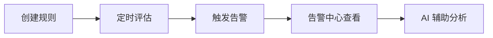

<p align="center">
  <a href="告警.md">中文</a>
  &nbsp;|&nbsp;
  <a href="告警_en.md">English</a>
</p>

# 使用手册 · 告警

指标异常时自动记录事件并触发告警。

---

## 能力概览

| 能力 | 说明 |
|------|------|
| **阈值告警** | 错误率、延迟、吞吐等指标超线触发 |
| **突变检测** | 捕捉指标的突然变化 |
| **定时评估** | 每分钟自动检查，回看最近 5 分钟数据 |
| **事件记录** | 记录触发、恢复、处理状态（指标恢复后自动标记已解决） |
| **AI 分析** | 告警详情内可直接追问根因 |

评估机制详见 [架构设计 · 告警](../架构设计/告警.md)。

---

## 菜单入口

| 功能 | 路径 |
|------|------|
| 检测规则 | 配置管理 → 告警配置 |
| 告警列表 | 告警中心 → 告警列表 |

> 外部通知（Webhook、邮件等）尚未支持，见 [Roadmap](../Roadmap.md)「告警更强 → 通知集成」。

---

## 使用流程



### 1. 创建检测规则

**配置管理 → 告警配置 → 新建规则**

可配置项：

- **监控对象**：服务或实例范围
- **指标**：错误率、平均延迟、P99 延迟、请求量等
- **条件**：阈值（大于/小于）或突变检测
- **级别**：提示 / 警告 / 严重
- **评估周期**：跟随平台默认定时任务（每分钟）

### 2. 查看与处理告警

**告警中心 → 告警列表**

按服务、级别、状态筛选。点击告警进入详情，可查看：

- 异常指标趋势
- 关联 Trace 与日志
- （可选）AI 根因分析，或 **告警中心 → 手动根因分析** 指定时间范围排查
- 处理日志

指标恢复后告警自动标记为已解决。

---

## 配置示例

下面以 `order-service` 为例，配置“最近 5 分钟平均错误率超过 5%”的严重告警。

### 创建规则

进入 **配置管理 → 告警配置 → 新建规则**，填写以下内容：

| 配置项 | 示例值 | 说明 |
|------|------|------|
| 规则名称 | `order-service 错误率过高` | 用于在规则列表和事件记录中识别规则 |
| 状态 | 启用 | 只有启用的规则才会参与评估 |
| 指标 | `service.error.pct` | 服务入口错误率，单位为百分比 |
| 统计方式 | 平均值 | 对统计窗口内的错误率取平均值 |
| 评估周期 | 5 分钟 | 系统保存为 `period: 300` 秒，并读取最近 5 分钟数据 |
| 比较条件 | 大于 `>` | 指标值严格大于阈值时触发 |
| 严重阈值 | `5%` | 错误率超过 5% 时触发严重告警 |
| 监控范围 | `service = order-service` | 只监控指定服务 |

该配置对应的 JSON 如下。实际使用时推荐通过页面填写，页面会自动生成并保存相应的规则数据：

```json
{
  "classification": "singleMetric",
  "ruleName": "order-service 错误率过高",
  "enabled": true,
  "query": {
    "1": {
      "way": "threshold",
      "period": 300,
      "unit": "%",
      "view_unit": "%",
      "_scale": 1,
      "time_aggregator": "avg",
      "comparison": ">",
      "thresholds": {
        "critical": 5,
        "warning": null
      },
      "A": {
        "metric": "service.error.pct",
        "aggs": "avg",
        "by": ["service"],
        "from": [
          {
            "connector": "AND",
            "left": "service",
            "operator": "=",
            "right": "order-service"
          }
        ]
      }
    }
  }
}
```

其中：

- `period: 300` 表示 300 秒，也就是 5 分钟；当前实现按这个时间窗口计算指标。
- `service.error.pct` 返回百分比值，因此阈值应填写 `5`，而不是 `0.05`。
- `by: ["service"]` 按服务分组；如果要监控所有服务，可以删除 `from` 中的服务过滤条件。
- 当前示例表示“最近 5 分钟窗口的平均错误率大于 5%”，不表示连续 5 个采样点都必须超过阈值。

### 触发后的结果

系统每分钟评估一次规则。满足条件后：

- **告警中心 → 告警列表** 会出现对应告警；
- 事件记录会包含规则名称、服务、级别、触发状态和告警描述；
- 告警详情可以查看异常指标趋势，并继续关联 Trace、日志和 AI 分析；
- 指标恢复到阈值以内后，告警会自动标记为已解决。

---

## 与 AI 协同

告警详情页或 AI 平台可直接问：

> 「order-service 错误率告警，帮我分析原因」

AI 会查指标、Trace、拓扑并给出诊断。Agent 集成场景下可通过 MCP 工具 `queryServiceAlarms` 查询告警，详见 [Agent 集成](Agent集成.md)。

---

## 常见问题

| 现象 | 处理 |
|------|------|
| 规则创建后无告警 | 确认服务已有指标；评估每分钟执行；检查监控对象是否匹配（见 [Docker](../运维参考/Docker运维.md#常见故障) / [K8s](../运维参考/K8s运维.md#常见故障) 运维排障） |
| Demo 装完看不到告警 | 先创建并启用检测规则，装 Demo 产生流量后等待 1–2 个评估周期 |
| 告警过多 | 调整阈值或收紧监控对象范围 |
