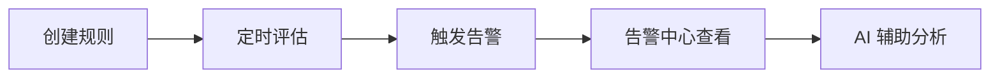

<p align="center">
  <a href="告警.md">中文</a>
  &nbsp;|&nbsp;
  <a href="告警_en.md">English</a>
</p>

# 使用手册 · 告警

指标异常时自动记录事件并触发告警。

---

## 能力概览

| 能力 | 说明 |
|------|------|
| **阈值告警** | 错误率、延迟、吞吐等指标超线触发 |
| **突变检测** | 捕捉指标的突然变化 |
| **定时评估** | 每分钟自动检查，回看最近 5 分钟数据 |
| **事件记录** | 记录触发、恢复、处理状态（指标恢复后自动标记已解决） |
| **AI 分析** | 告警详情内可直接追问根因 |

评估机制详见 [架构设计 · 告警](../架构设计/告警.md)。

---

## 菜单入口

| 功能 | 路径 |
|------|------|
| 检测规则 | 配置管理 → 告警配置 |
| 告警列表 | 告警中心 → 告警列表 |

> 外部通知（Webhook、邮件等）尚未支持，见 [Roadmap](../Roadmap.md)「告警更强 → 通知集成」。

---

## 使用流程


```mermaid
flowchart LR
  A["创建规则"] --> B["定时评估"]
  B --> C["触发告警"]
  C --> D["告警中心查看"]
  D --> E["AI 辅助分析"]
```

### 1. 创建检测规则

**配置管理 → 告警配置 → 新建规则**

可配置项：

- **监控对象**：服务或实例范围
- **指标**：错误率、平均延迟、P99 延迟、请求量等
- **条件**：阈值（大于/小于）或突变检测
- **级别**：提示 / 警告 / 严重
- **评估周期**：跟随平台默认定时任务（每分钟）

### 2. 查看与处理告警

**告警中心 → 告警列表**

按服务、级别、状态筛选。点击告警进入详情，可查看：

- 异常指标趋势
- 关联 Trace 与日志
- （可选）AI 根因分析，或 **告警中心 → 手动根因分析** 指定时间范围排查
- 处理日志

指标恢复后告警自动标记为已解决。
---

## 配置示例

以「order-service 错误率连续 5 分钟高于 5%」为例。在 **配置管理 → 告警配置 → 新建规则** 按下表填写：

| 字段 | 取值 | 说明 |
|------|------|------|
| 规则名称 | `order-service 错误率过高` | 告警列表里用来辨认这条规则 |
| 监控对象 | `order-service` | 只评估该服务；也可改成实例 |
| 指标 | 错误率（`error_rate` / `service.error.pct`） | 用百分比，不是 0–1 小数 |
| 条件 | 阈值，大于（`gt`） | 也可用小于，或改成突变检测 |
| 阈值 | `5` | 即 5% |
| 回看窗口 | `300` 秒 | 每次评估看最近 5 分钟；平台默认每分钟跑一次 |
| 级别 | 严重（`critical`） | 也可选提示 / 警告 |
| 启用 | 是 | 关掉后不再评估 |

等价 YAML：

```yaml
ruleName: order-service 错误率过高
enabled: true
service: order-service
metric: error_rate
detectionWay: threshold
comparator: gt
threshold: 5
period: 300          # seconds, last 5 minutes
level: critical
```

对应规则查询 JSON（`queryJson` 里的评估块）：

```json
{
  "1": {
    "way": "threshold",
    "period": 300,
    "view_unit": "%",
    "thresholds": { "critical": 5 },
    "A": { "metric": "service.error.pct", "from": [] }
  }
}
```

保存并启用后，评估任务按分钟检查最近 5 分钟错误率。一旦高于 5%，**告警中心 → 告警列表** 会出现一行，描述类似「错误率的 12% 值超过阈值 5%」，状态为待处理，并可点进详情看指标趋势、关联 Trace / 日志。指标回落后该行自动标为已解决；同一告警下的触发记录可在详情的事件列表里查看。

---

## 与 AI 协同

告警详情页或 AI 平台可直接问：

> 「order-service 错误率告警，帮我分析原因」

AI 会查指标、Trace、拓扑并给出诊断。Agent 集成场景下可通过 MCP 工具 `queryServiceAlarms` 查询告警，详见 [Agent 集成](Agent集成.md)。

---

## 常见问题

| 现象 | 处理 |
|------|------|
| 规则创建后无告警 | 确认服务已有指标；评估每分钟执行；检查监控对象是否匹配（见 [Docker](../运维参考/Docker运维.md#常见故障) / [K8s](../运维参考/K8s运维.md#常见故障) 运维排障） |
| Demo 装完看不到告警 | 先创建并启用检测规则，装 Demo 产生流量后等待 1–2 个评估周期 |
| 告警过多 | 调整阈值或收紧监控对象范围 |
