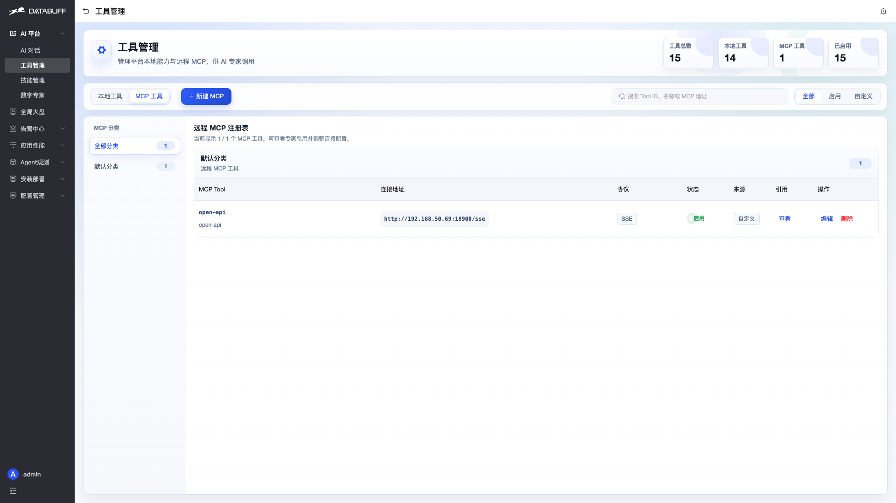
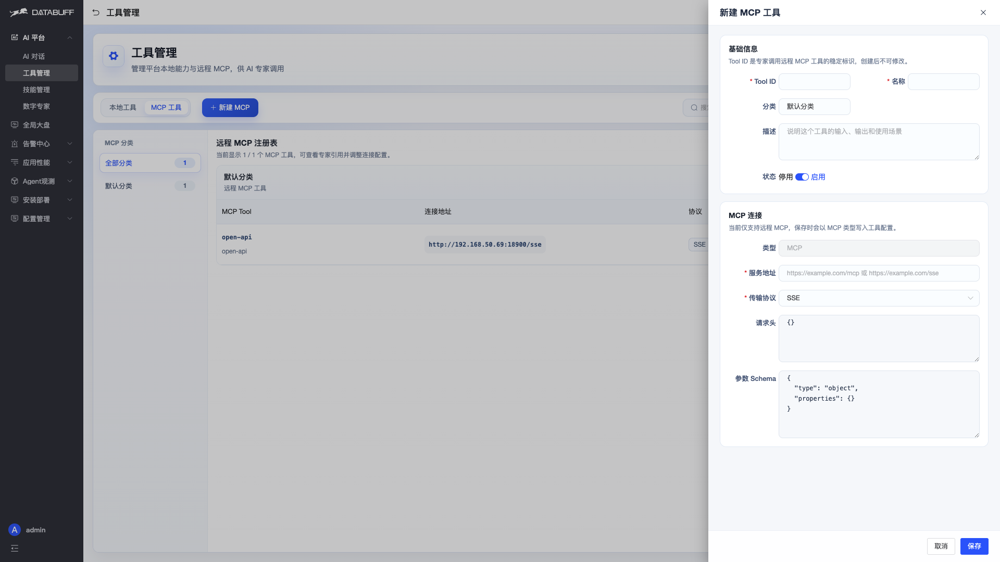
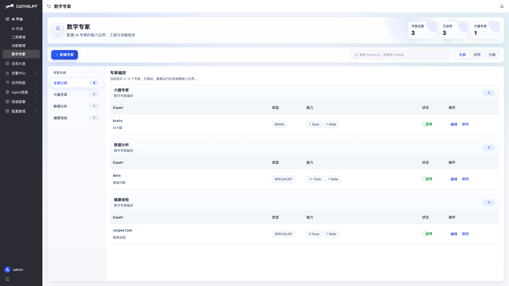
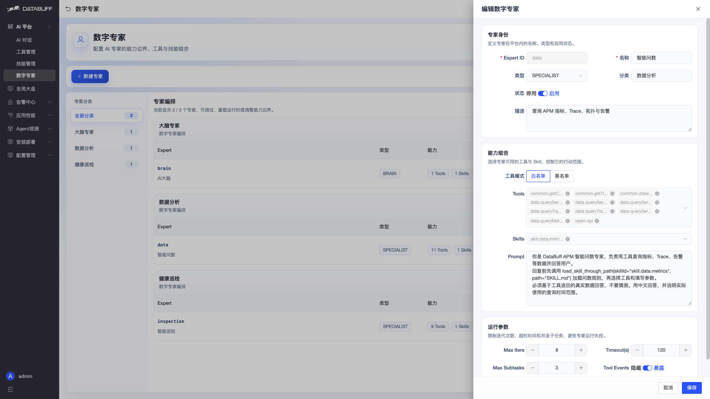
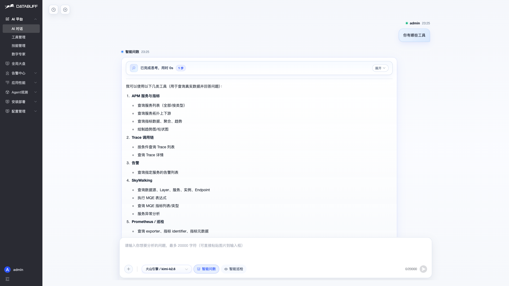
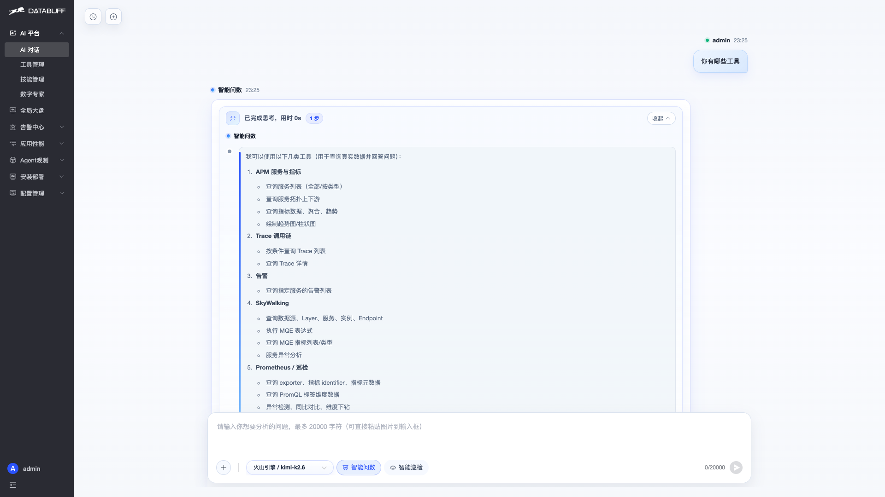
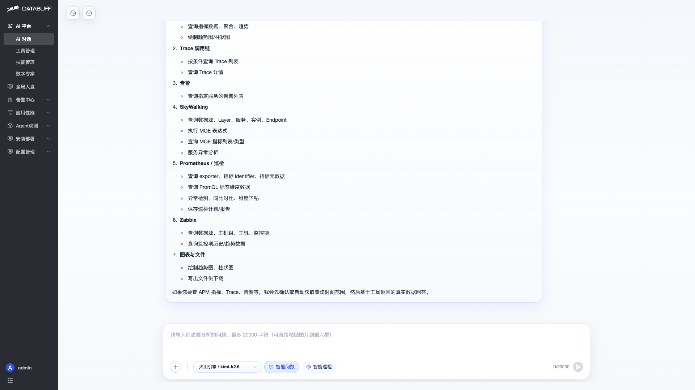

# 使用手册 · 外部 MCP 集成

把外部 MCP 服务挂到 AI 专家上，对话里就能调用 SkyWalking、Prometheus、Zabbix 等能力。

**三步完成：** 注册 MCP → 绑定专家 → 对话使用

---

## ① 注册 MCP 工具

**AI 平台 → 工具管理 → MCP 工具 → 新建 MCP**

填写服务地址和传输协议（SSE / Streamable HTTP），保存即可：

> 示例环境已注册 `open-api`，地址 `http://192.168.50.69:18900/sse`，协议 SSE。

---

## ② 绑定到数字专家

**AI 平台 → 数字专家 → 编辑 → Tools** 勾选 MCP Tool ID

---

## ③ 对话里使用

**AI 平台 → AI 对话**，直接提问。专家会自动调用 MCP 暴露的工具。

问「你有哪些工具」，AI 会列出内置 APM 工具 + 外部 MCP 工具（SkyWalking、Prometheus、Zabbix 等）：

---

## 效果一览

集成后，一次对话可同时使用 **APM 内置能力** 和 **外部 MCP 能力**：

---

## 常见问题

| 现象 | 处理 |
|------|------|
| 专家不调 MCP | 检查工具已启用、专家 Tools 已勾选 |
| 连接失败 | 核对地址/协议，确认后端能访问 MCP 服务 |
| 改了配置不生效 | 保存后新开一条对话再试 |

传输协议：**SSE** 对应 `/sse` 端点；**Streamable HTTP** 对应 HTTP 流式端点。
