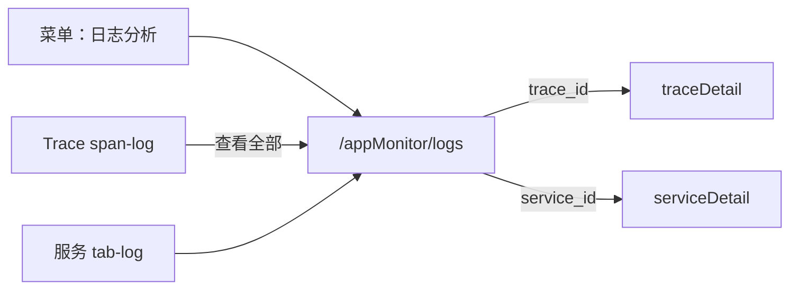

<p align="center">
  <a href="日志分析.md">中文</a>
  &nbsp;|&nbsp;
  <a href="日志分析_en.md">English</a>
</p>

# 日志分析 · 产品方案（v0.2.0+）

> **v0.2.0+**：OTLP Logs 接入、`/log/search` API 与 Trace/服务详情内日志 Tab 已可用。独立菜单 **「日志分析」**（全局检索页）持续迭代中。

## 1. 背景与定位

v0.2.0 已打通 **OTLP Logs → Doris `log_dc_record` → `/log/search`**，并在 Trace 详情、服务详情、告警事件等场景嵌入了日志 Tab。

下一步在 **应用性能 → 链路追踪** 下方增加独立菜单 **「日志分析」**，作为全局日志检索入口。

**定位：APM 语境下的日志探索**，而非对标 ELK/Loki 的通用日志平台。核心差异是与 Trace / 服务 / 实例天然关联，而非独立 LogQL/KQL 体系。

## 2. 业界方案调研摘要

| 产品 | 核心交互 | 可借鉴点 |
|------|---------|---------|
| Datadog Log Explorer | 时间柱状图 + Facet 筛选 + 全文搜索 | 三段式：时间分布 + 左侧维度 + 主列表 |
| Grafana Explore (Loki) | LogQL + Label 选择器 | v0.2.0 不推查询语言（Doris 无 LogQL） |
| Elastic Discover | KQL + 字段侧边栏 + 文档表 | `attributes_json` 字段面板留二期 |
| SigNoz | Query Builder + Trace↔Log 互跳 | **首选参考**：统一时间、服务筛选、Trace 关联 |
| Jaeger/Tempo | 日志仅在 Span 上下文 | 已有 `span-log.vue`，独立页补「日志→Trace」 |

**共性布局：**

```
┌─────────────────────────────────────────────────────────┐
│  全局时间 + 关键词/traceId 搜索 + 刷新 + 采集配置说明      │
├─────────────────────────────────────────────────────────┤
│  日志量时间柱状图（点击缩窄时间窗）                        │
├──────────┬──────────────────────────────────────────────┤
│ 左侧筛选  │  日志列表                                     │
│ · 服务   │  时间 / 级别 / 服务 / 主机 / 摘要              │
│ · 主机   │  展开行 → body + attributes                   │
│ · 级别   │  行操作 → 上下文 / 跳转 Trace / 服务详情       │
└──────────┴──────────────────────────────────────────────┘
```

**v0.2.0 不做：** Live Tail、复杂查询语法、日志聚类/模式识别。

## 3. 现状与可复用资产

| 层级 | 现状 |
|------|------|
| 存储 | `log_dc_record`：`trace_id`、`span_id`、`service_id`、`hostname`、`severity`、`body`、`attributes_json` 等 |
| 后端 | `POST /log/search`（关键词、服务、主机、trace/span、时间、offset）；`POST /log/conditions`（枚举待完善） |
| 前端 API | `src/api/log.ts` |
| 嵌入场景 | `span-log.vue`、`serviceDetail/tab-log.vue`、`serviceInstance/tab-log.vue`、`eventDetail/tab-log.vue` |
| 独立页 | **未实现**（前端文档 `/log` 为规划态） |

## 4. 设计原则

1. **与 APM 页面一致**：复用链路追踪/错误分析的全局时间、`choose-collapse`、`db-table` offset 分页。
2. **Trace 关联优先**：有 `trace_id` 可跳转调用链；无 trace 仍可按服务/主机排查。
3. **渐进增强**：MVP 检索 + Trace 互跳；上下文、对比分阶段交付。
4. **复用组件**：列表与展开行对齐 `eventDetail/tab-log.vue`。

## 5. 页面方案

### 5.1 信息架构

| 项 | 建议 |
|----|------|
| 菜单位置 | 应用性能 → 链路追踪（409）下方，`order: 9.5` |
| 路由 | `/appMonitor/logs` |
| 菜单名 | 日志分析 |
| 时间控件 | 启用全局时间（与链路追踪一致） |
| 配置入口 | `/config/install?type=log` |

### 5.2 页面结构

```
/appMonitor/logs/
├── search-bar.vue       # 关键词 + traceId
├── log-histogram.vue    # 日志量柱状图（P0 后端 histogram 就绪后）
├── choose-collapse.vue  # 服务 / 主机 / 级别
└── log-table.vue        # 主列表 + 展开行 + 行操作
```

### 5.3 列表字段（MVP）

| 列 | 说明 |
|----|------|
| 时间 | `timestamp` → `_timestamp` |
| 级别 | `status`（severity），色标对齐 `span-log.vue` |
| 服务 | 可跳转服务详情 |
| 主机 | 可跳转实例详情（有映射时） |
| 摘要 | `message` 截断，展开看全文 |
| Trace | `trace_id` 非空时显示跳转 `traceDetail` |

### 5.4 核心交互与优先级

| 交互 | 优先级 |
|------|--------|
| 关键词搜索（`body LIKE`） | P0 |
| TraceId 精确搜索 | P0 |
| 左侧 Facet：服务 / 主机 / 级别 | P0 |
| 展开行完整 message | P0 |
| 跳转 Trace | P0 |
| 图表点击缩窄时间 | P1 |
| 查看上下文（more-log） | P1 |
| 双日志 diff 对比 | P2 |

### 5.5 URL 状态

```
/appMonitor/logs?query=timeout&traceId=abc&services=svc1&hosts=h1&severities=ERROR,WARN&sf=...&st=...
```

告警、错误分析、Trace 详情可通过 URL 深链并预填筛选。

## 6. 页面联动



## 7. 后端补强（支撑独立页）

| 能力 | v0.2.0 建议 |
|------|------------|
| 返回 `trace_id` / `span_id` | search 响应补充 |
| `severity` 筛选 | `LogQueryBuilder` 增加 IN 条件 |
| `conditions` 枚举 | 按时间窗 DISTINCT service/hostname |
| `POST /log/histogram` | 时间桶 + 按级别分色（P1） |
| 上下文查询 | `anchorTimeNs` + direction（P1） |

## 8. 分期交付

### Phase 0 — MVP（日志分析页首期）

- 路由/菜单/breadcrumb/i18n
- 搜索 + Facet + 列表 + 展开行
- 后端：trace_id 返回、severity 筛选、conditions
- Trace 互跳

### Phase 1 — v0.2.x

- 时间柱状图
- 上下文面板
- Trace/服务侧栏「在日志分析中打开」

### Phase 2 — 后续

- 双日志 diff
- `attributes_json` 字段面板
- AI 问数接入

## 9. 与 v0.2.0 OTLP 日志 KR 的关系

| 范围 | v0.2.0 KR 已含 | 本方案（日志分析页） |
|------|---------------|-------------------|
| OTLP 接入与 Doris 写入 | ✅ | 依赖 |
| Trace 侧栏关联日志 | ✅ | 互跳入口 |
| `/log/search` API | ✅ 基础版 | 需补强字段与筛选 |
| 独立「日志分析」菜单页 | ❌ 原设计留 v0.3+ | **本期新增 scope** |

---

*下一步：路由注册 → 后端 API 补强 → `src/views/appMonitor/logs/` 页面实现。*
