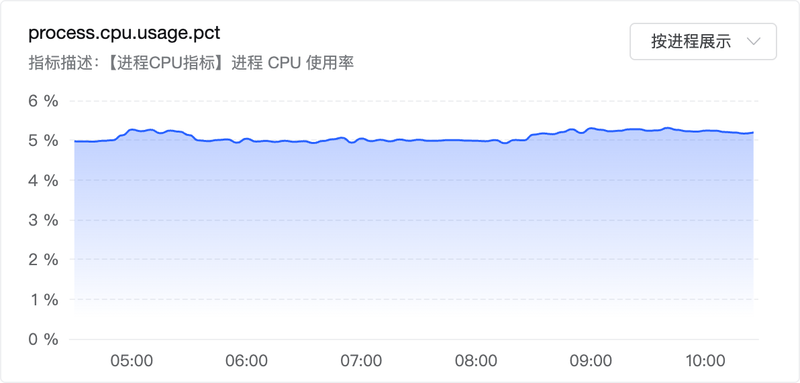
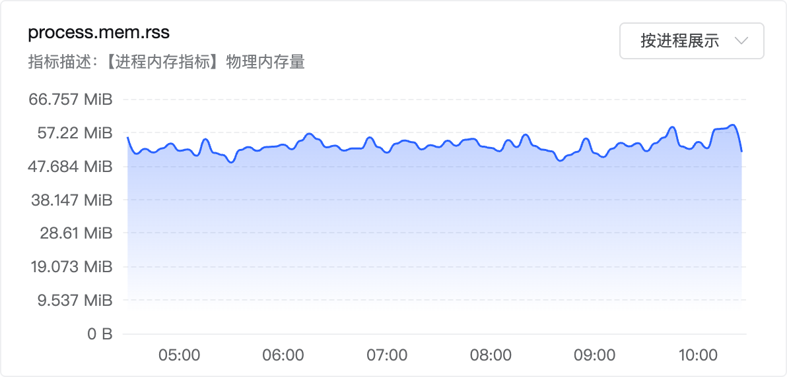
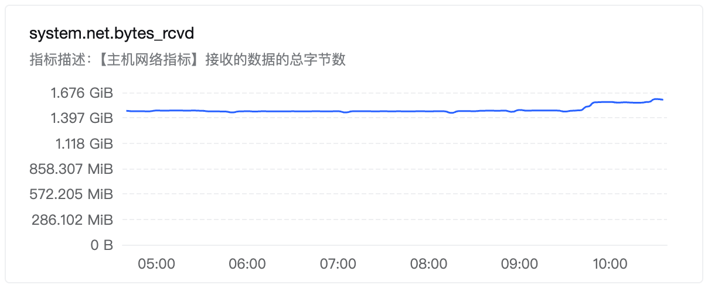
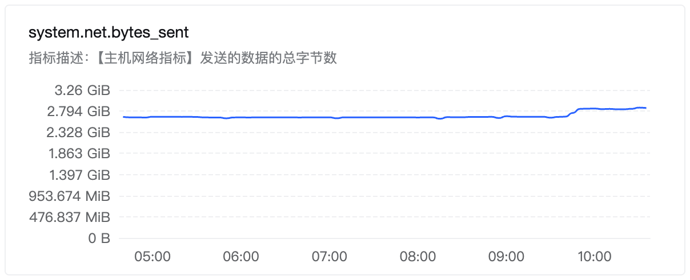

# databuff-proxy Dual-Write Stability

[databuff-proxy](https://github.com/databufflabs/databuff-proxy) fans SkyWalking Agent traffic out to multiple backends. This page summarizes load and stability results. Migration steps: [From SkyWalking to DataBuff](./from-skywalking-to-databuff_en.md) Option B.

## What we tested

```
App traffic ──▶ proxy ──▶ SkyWalking
                   └──▶ DataBuff
```

Load: QPS = **35** (~5800 forwards/s × 2 paths)  
Ingest: DataBuff ~**11.3k span/s** · SkyWalking ~**5805 segment/s**

| Metric | Result |
|--------|--------|
| CPU | **0.89 cores** (under 1 core; not host-wide %) |
| Memory | **~47 MB**, flat overnight |
| Uptime | **10h+**, process stayed up |

## 1. Resource stability

~6 hours of monitoring (process CPU / RSS; host NIC RX / TX):









**Verdict:** Under 1 core, flat memory, steady network.

## 2. Abnormal scenarios

| Scenario | Behavior | Result |
|----------|----------|--------|
| One backend down | Bad path circuits open; other path keeps writing; proxy stays up | OK |
| Manually disable one write path | That path stops; other unaffected; re-enable recovers | OK |
| Sustained high load | No drops / errors on either path | OK |
| Long run | 10h+ still forwarding; memory flat | OK |
| Restart after config change | Comes back and dual-writes again | OK |

**Verdict:** Failures isolate correctly; the proxy does not go down with a bad backend.

## 3. Conclusion

| Check | Result |
|-------|--------|
| Resource stability | Pass |
| Abnormal scenarios | Pass |

**Ready for production use:** dual-write is reliable; resource cost is small.

> Note: entry call counts matched on both sides (service-a–d ≥ 99.98%); not the focus of this page.

## See also

- [From SkyWalking to DataBuff](./from-skywalking-to-databuff_en.md) (Option B)
- [databuff-proxy repository](https://github.com/databufflabs/databuff-proxy)
- [Blog · Dual-Write Stability](/blog/en/databuff-proxy-dual-write-stability/)
- [Full Markdown report in repo](https://github.com/databufflabs/databuff-proxy/blob/main/docs/reports/proxy-fanout-verify-20260730-091800.md)
