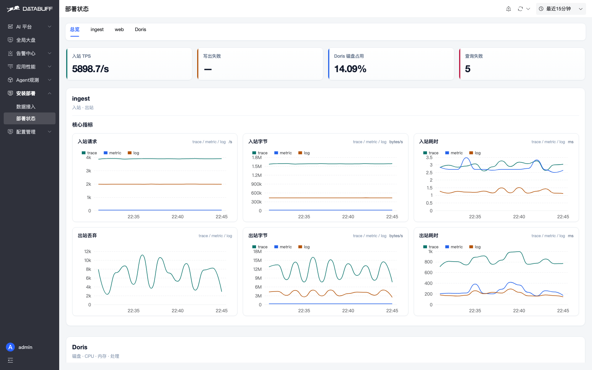
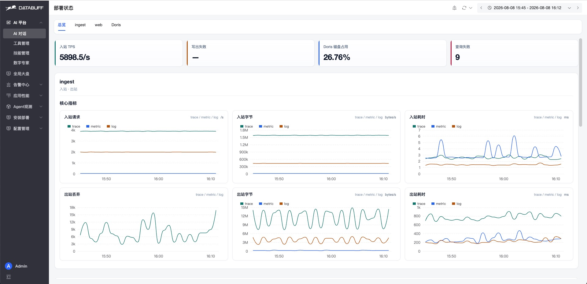
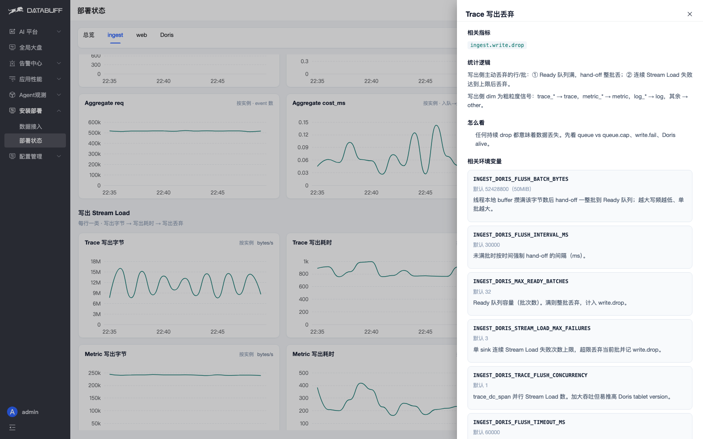
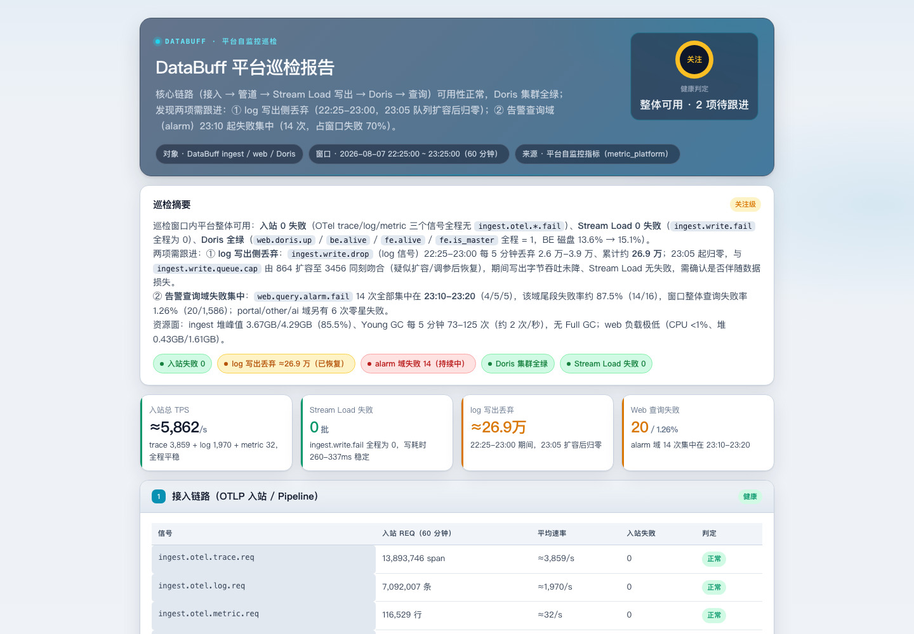
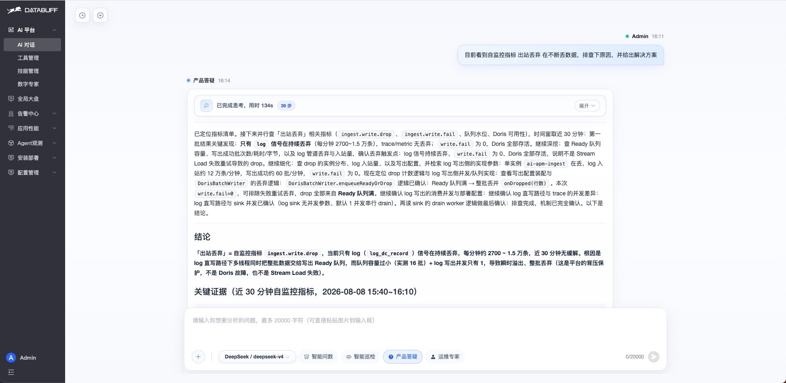
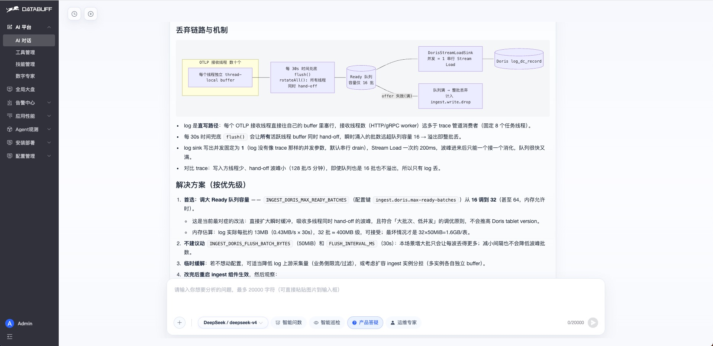
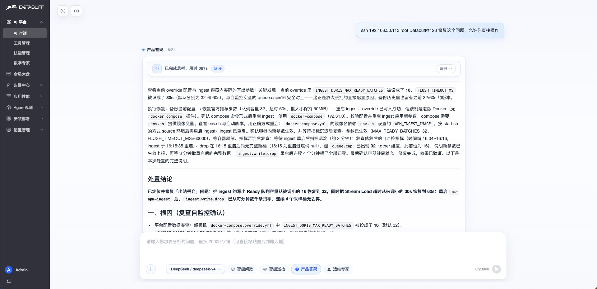
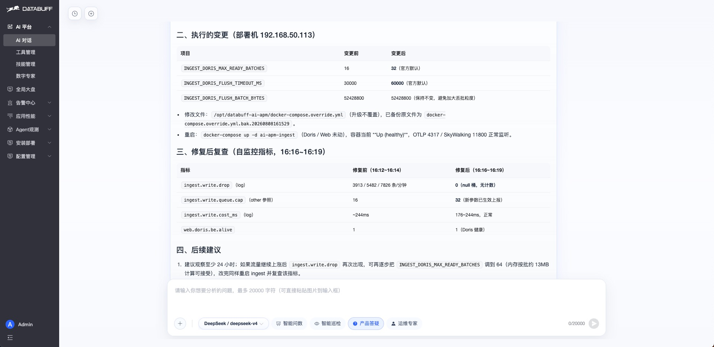
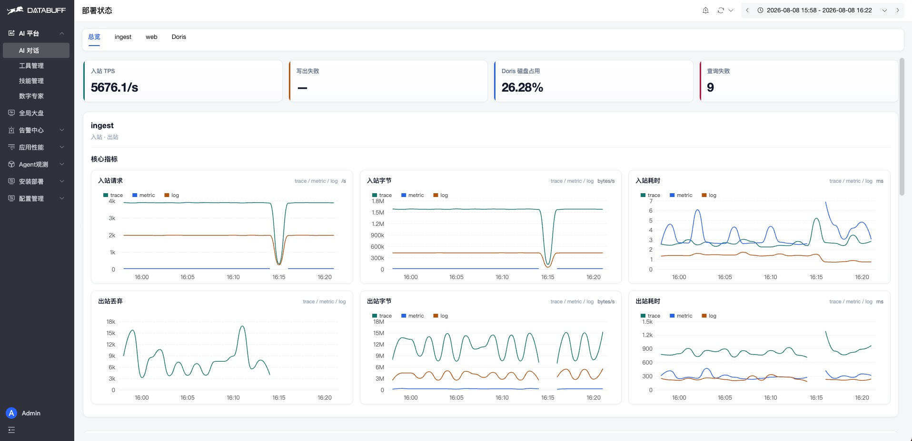

  <a href="平台自监控与自排障.md">中文</a>
  &nbsp;|&nbsp;
  <a href="平台自监控与自排障_en.md">English</a>

# 平台自监控与自排障

DataBuff 会「照顾自己」：它把自己也当成一个被监控的系统，盯着三个核心组件——**ingest**（收数据）、**web**（查数据）、**Doris**（存数据）。平台哪里堵了、哪里在丢数据、该调哪个参数，不用你翻日志猜，页面上一眼就能看到，说句话 AI 还能帮你查、帮你修。

平台自监控一共有 **5 个能力**，下面一个个讲怎么用。

---

## 能力一：会看自己 —— 打开「部署状态」页

**入口**：左侧菜单 **安装部署 → 部署状态**（路由 `/deploy/status`）。

打开后先看**总览**页签的四张卡片，平台健不健康先说结论：

| 卡片 | 看什么 |
|------|--------|
| **入站 TPS** | 现在每秒钟收进来多少数据 |
| **写出失败** | 有没有数据写不进 Doris（非 0 就要注意） |
| **Doris 磁盘占用** | 存储还够不够 |
| **查询失败** | 查数据有没有报错 |

再往下翻，还有三个页签，想看哪个组件点哪个：

- **ingest 页签**：数据是怎么收进来、怎么处理、怎么写出去的，每路信号（trace / metric / log）有没有丢
- **web 页签**：平台查询接口快不快、有没有报错
- **Doris 页签**：存储节点活没活着、磁盘和 CPU 什么状态

**重点看两个红色信号**（只要持续非 0 就要处理）：
- **Pipeline 丢弃**：管道塞满了，数据会丢
- **写出丢弃**：写 Doris 的队列满了，数据会丢

---

## 能力二：懂自己 —— 每个指标都带「说明书」

不用背指标。**点任何一张图的标题**，右侧会弹出一个说明抽屉，把这个指标讲清楚：

- 这个指标**怎么算的**
- **该不该担心**（什么时候算异常）
- 异常了**该调哪个环境变量、默认值是多少**

比如点「写出丢弃」，它会告诉你：数据只在「队列满」或「连续写入失败」时才会丢，并直接列出该调的参数和默认值。

---

## 能力三：会体检 —— 一句话让 AI 做全平台巡检

不想一页页翻图？直接在 **AI 平台**说一句：

> 对 DataBuff 平台进行巡检，并出一份 html 巡检报告

产品答疑专家会自动读指标清单、查平台自监控数据、把异常挑出来，最后给你一份**能直接转发的 HTML 巡检报告**。

---

## 能力四：会诊断 —— 让 AI 自己查丢数据的原因

页面看到丢数据了，不用自己一层层猜。在 AI 平台让产品答疑专家去查，它会一步步排查：

1. 排除「不是问题」的项（业务侧正常、Doris 存储正常）
2. 定位到真正的根因（比如写 Doris 的队列太小，突发数据装不下被整批丢弃）
3. 给出带证据的结论和修复建议

---

## 能力五：会修复 —— AI 帮你改参数、重启

排查出的建议，产品答疑专家**可以自己动手修**：登录服务器 → 改配置 → 重启组件 → 复查确认，全程不用你上手。

实际案例（log 数据一直丢）：

| 参数 | 异常时 | 调整后 | 作用 |
|------|--------|--------|------|
| `INGEST_DORIS_MAX_READY_BATCHES` | 16 | 32 | 写出队列太小，调大一倍 |
| `INGEST_DORIS_FLUSH_TIMEOUT_MS` | 30s | 60s | 恢复默认，避免大批次误失败 |

修完后复查「写出丢弃」归零，问题解决：

---

## 上手三件事

装好 DataBuff 后，建议按顺序做：

1. **打开部署状态页**，先扫一眼四张卡片
2. **让 AI 做一次巡检**，把报告转发给团队
3. **遇到丢数据**，让 AI 排查并修复，别自己翻手册

---

## 想深入了解？

指标全名、计算口径、所有环境变量的详细说明，见 [平台自监控指标清单](自监控指标清单.md)。
